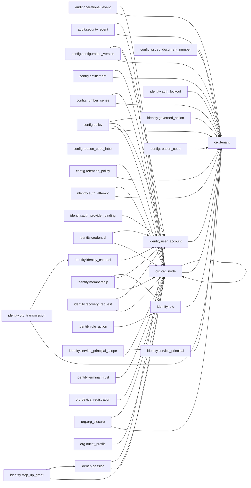

# Schema and Domain Catalog

**Generated from the live database by `tools/generate_schema_catalog.py`.**
Do not edit by hand: the verification suite regenerates this file and fails on any
difference, so a hand edit is reported as drift (FR-DAT-015).

Schemas covered: `app`, `org`, `identity`, `money`, `config`, `audit`.

---

## Domains

| Domain | Base type | Purpose |
|---|---|---|
| `money.amount_minor` | `bigint` | A monetary amount in integer minor units of an explicit currency (for ETB, cents). Never a float, never a bare decimal. Any column of this type must sit beside a currency_code column; money.assert_currency_paired() proves it. |
| `money.percentage` | `numeric(7,4)` |  |
| `money.quantity` | `numeric(14,4)` |  |

## Enumerated types

| Type | Values |
|---|---|
| `config.configuration_category` | branding, locale, currency, timezone, tax, calendar, numbering, payment_method, service, feature, connector |
| `config.policy_category` | ordering, service, cancellation, discount, refund, tip, cash, approval, local_continuity |
| `config.reason_code_category` | order_cancellation, void, refund, discount, complimentary_item, payment_reversal, tip_correction, service_failure, printer_failure, manager_override |
| `config.retention_action` | archive, purge |
| `config.scope_kind` | tenant, legal_entity, outlet |
| `identity.auth_strength` | low, standard, strong |
| `identity.channel_kind` | phone, email |
| `identity.credential_kind` | password, otp, quick_pin, service_secret |
| `identity.principal_class` | worker, integration, edge_node, print_agent |
| `identity.revocation_reason` | signed_out, expired, membership_withdrawn, security_event, rotated, administrator_revoked, recovery |
| `identity.transmission_mode` | simulated, live |
| `money.rounding_mode` | half_up, half_even, floor, ceiling |
| `org.lifecycle_status` | active, inactive, archived |
| `org.node_kind` | brand, legal_entity, outlet, service_area, preparation_station, dining_table, device |

## Relationships

Foreign-key edges between tables, read from `pg_constraint`.

## Schemas

### `app`

Request-context accessors and shared trigger functions.

### `audit`

Append-only security and operational audit storage (FR-SEC-009).

#### `audit.operational_event`

Append-only operational audit. Every configuration and policy change writes a row here carrying the actor, the approval and the effective date (FR-TEN-010).

Row level security: **enabled**, **forced**.

| Column | Type | Null | Default | Notes |
|---|---|---|---|---|
| `id` | `bigint` | NOT NULL |  |  |
| `tenant_id` | `uuid` | NOT NULL |  |  |
| `outlet_id` | `uuid` |  |  |  |
| `event_code` | `text` | NOT NULL |  |  |
| `entity_schema` | `text` | NOT NULL |  |  |
| `entity_table` | `text` | NOT NULL |  |  |
| `entity_id` | `text` |  |  |  |
| `actor_id` | `uuid` |  |  |  |
| `approved_by_id` | `uuid` |  |  |  |
| `approved_at` | `timestamp with time zone` |  |  |  |
| `effective_from` | `timestamp with time zone` |  |  |  |
| `occurred_at` | `timestamp with time zone` | NOT NULL | `now()` |  |
| `detail` | `jsonb` | NOT NULL | `'{}'::jsonb` |  |

Constraints:

- `operational_event_code_not_blank` — `CHECK ((btrim(event_code) <> ''::text))`
- `operational_event_outlet_fk` — `FOREIGN KEY (tenant_id, outlet_id) REFERENCES org.org_node(tenant_id, id) ON DELETE RESTRICT`
- `operational_event_pkey` — `PRIMARY KEY (id)`
- `operational_event_tenant_fk` — `FOREIGN KEY (tenant_id) REFERENCES org.tenant(id) ON DELETE RESTRICT`

Policies:

- `operational_event_isolation` — `app.row_in_scope(tenant_id, outlet_id)`

#### `audit.security_event`

Append-only security audit. This is where M1-B's recovery and lockout events land (FR-AUTH-010): M1-B emits them, M1-C stores them.

Row level security: **enabled**, **forced**.

| Column | Type | Null | Default | Notes |
|---|---|---|---|---|
| `id` | `bigint` | NOT NULL |  |  |
| `tenant_id` | `uuid` | NOT NULL |  |  |
| `outlet_id` | `uuid` |  |  |  |
| `event_code` | `text` | NOT NULL |  |  |
| `subject_id` | `uuid` |  |  |  |
| `actor_id` | `uuid` |  |  |  |
| `occurred_at` | `timestamp with time zone` | NOT NULL | `now()` |  |
| `detail` | `jsonb` | NOT NULL | `'{}'::jsonb` |  |

Constraints:

- `security_event_code_not_blank` — `CHECK ((btrim(event_code) <> ''::text))`
- `security_event_outlet_fk` — `FOREIGN KEY (tenant_id, outlet_id) REFERENCES org.org_node(tenant_id, id) ON DELETE RESTRICT`
- `security_event_pkey` — `PRIMARY KEY (id)`
- `security_event_tenant_fk` — `FOREIGN KEY (tenant_id) REFERENCES org.tenant(id) ON DELETE RESTRICT`

Policies:

- `security_event_isolation` — `app.row_in_scope(tenant_id, outlet_id)`

### `config`

Versioned tenant configuration, policy, numbering, entitlements.

#### `config.configuration_version`

Versioned, effective-dated tenant configuration (FR-TEN-003). A change never edits a row: it closes the open version and inserts the next one, so history is intact.

Row level security: **enabled**, **forced**.

| Column | Type | Null | Default | Notes |
|---|---|---|---|---|
| `id` | `uuid` | NOT NULL | `gen_random_uuid()` |  |
| `tenant_id` | `uuid` | NOT NULL |  |  |
| `outlet_id` | `uuid` |  |  |  |
| `scope_kind` | `config.scope_kind` | NOT NULL |  |  |
| `scope_node_id` | `uuid` |  |  |  |
| `category` | `config.configuration_category` | NOT NULL |  |  |
| `version` | `integer` | NOT NULL |  |  |
| `payload` | `jsonb` | NOT NULL |  |  |
| `effective_from` | `timestamp with time zone` | NOT NULL |  |  |
| `effective_to` | `timestamp with time zone` |  |  |  |
| `actor_id` | `uuid` | NOT NULL |  |  |
| `approved_by_id` | `uuid` | NOT NULL |  |  |
| `approved_at` | `timestamp with time zone` | NOT NULL |  |  |
| `created_at` | `timestamp with time zone` | NOT NULL | `now()` |  |

Constraints:

- `configuration_version_actor_fk` — `FOREIGN KEY (tenant_id, actor_id) REFERENCES identity.user_account(tenant_id, id) ON DELETE RESTRICT`
- `configuration_version_approver_fk` — `FOREIGN KEY (tenant_id, approved_by_id) REFERENCES identity.user_account(tenant_id, id) ON DELETE RESTRICT`
- `configuration_version_number_positive` — `CHECK ((version > 0))`
- `configuration_version_outlet_fk` — `FOREIGN KEY (tenant_id, outlet_id) REFERENCES org.org_node(tenant_id, id) ON DELETE RESTRICT`
- `configuration_version_pkey` — `PRIMARY KEY (id)`
- `configuration_version_scope_consistent` — `CHECK ((((scope_kind = 'tenant'::config.scope_kind) AND (scope_node_id IS NULL)) OR ((scope_kind <> 'tenant'::config.scope_kind) AND (scope_node_id IS NOT NULL))))`
- `configuration_version_scope_fk` — `FOREIGN KEY (tenant_id, scope_node_id) REFERENCES org.org_node(tenant_id, id) ON DELETE RESTRICT`
- `configuration_version_tenant_fk` — `FOREIGN KEY (tenant_id) REFERENCES org.tenant(id) ON DELETE RESTRICT`
- `configuration_version_unique` — `UNIQUE (tenant_id, scope_kind, scope_node_id, category, version)`
- `configuration_version_window_valid` — `CHECK (((effective_to IS NULL) OR (effective_to > effective_from)))`

Policies:

- `configuration_version_isolation` — `app.row_in_scope(tenant_id, outlet_id)`

#### `config.entitlement`

Module and feature entitlements per tenant, legal entity or outlet (FR-TEN-004). A missing row is a denial, never an implicit grant.

Row level security: **enabled**, **forced**.

| Column | Type | Null | Default | Notes |
|---|---|---|---|---|
| `id` | `uuid` | NOT NULL | `gen_random_uuid()` |  |
| `tenant_id` | `uuid` | NOT NULL |  |  |
| `outlet_id` | `uuid` |  |  |  |
| `scope_kind` | `config.scope_kind` | NOT NULL |  |  |
| `scope_node_id` | `uuid` |  |  |  |
| `feature_key` | `text` | NOT NULL |  |  |
| `granted` | `boolean` | NOT NULL |  |  |
| `created_at` | `timestamp with time zone` | NOT NULL | `now()` |  |

Constraints:

- `entitlement_feature_key_not_blank` — `CHECK ((btrim(feature_key) <> ''::text))`
- `entitlement_outlet_fk` — `FOREIGN KEY (tenant_id, outlet_id) REFERENCES org.org_node(tenant_id, id) ON DELETE RESTRICT`
- `entitlement_pkey` — `PRIMARY KEY (id)`
- `entitlement_scope_consistent` — `CHECK ((((scope_kind = 'tenant'::config.scope_kind) AND (scope_node_id IS NULL)) OR ((scope_kind <> 'tenant'::config.scope_kind) AND (scope_node_id IS NOT NULL))))`
- `entitlement_scope_fk` — `FOREIGN KEY (tenant_id, scope_node_id) REFERENCES org.org_node(tenant_id, id) ON DELETE RESTRICT`
- `entitlement_tenant_fk` — `FOREIGN KEY (tenant_id) REFERENCES org.tenant(id) ON DELETE RESTRICT`
- `entitlement_unique` — `UNIQUE (tenant_id, scope_kind, scope_node_id, feature_key)`

Policies:

- `entitlement_isolation` — `app.row_in_scope(tenant_id, outlet_id)`

#### `config.issued_document_number`

Ledger of issued human document numbers. The unique constraint is the last line of defence: even a defective issuer cannot persist a duplicate.

Row level security: **enabled**, **forced**.

| Column | Type | Null | Default | Notes |
|---|---|---|---|---|
| `tenant_id` | `uuid` | NOT NULL |  |  |
| `legal_entity_id` | `uuid` |  |  |  |
| `outlet_id` | `uuid` |  |  |  |
| `document_type` | `text` | NOT NULL |  |  |
| `fiscal_period` | `text` | NOT NULL |  |  |
| `document_number` | `text` | NOT NULL |  |  |
| `issued_at` | `timestamp with time zone` | NOT NULL | `now()` |  |

Constraints:

- `issued_document_number_tenant_fk` — `FOREIGN KEY (tenant_id) REFERENCES org.tenant(id) ON DELETE RESTRICT`
- `issued_document_number_unique` — `UNIQUE (tenant_id, document_type, fiscal_period, document_number)`

Policies:

- `issued_document_number_isolation` — `app.row_in_scope(tenant_id, outlet_id)`

#### `config.number_series`

Row level security: **enabled**, **forced**.

| Column | Type | Null | Default | Notes |
|---|---|---|---|---|
| `id` | `uuid` | NOT NULL | `gen_random_uuid()` |  |
| `tenant_id` | `uuid` | NOT NULL |  |  |
| `legal_entity_id` | `uuid` |  |  |  |
| `outlet_id` | `uuid` |  |  |  |
| `document_type` | `text` | NOT NULL |  |  |
| `fiscal_period` | `text` | NOT NULL |  |  |
| `prefix` | `text` | NOT NULL | `''::text` |  |
| `next_value` | `bigint` | NOT NULL | `1` |  |

Constraints:

- `number_series_document_type_not_blank` — `CHECK ((btrim(document_type) <> ''::text))`
- `number_series_entity_fk` — `FOREIGN KEY (tenant_id, legal_entity_id) REFERENCES org.org_node(tenant_id, id) ON DELETE RESTRICT`
- `number_series_fiscal_period_not_blank` — `CHECK ((btrim(fiscal_period) <> ''::text))`
- `number_series_next_value_positive` — `CHECK ((next_value > 0))`
- `number_series_outlet_fk` — `FOREIGN KEY (tenant_id, outlet_id) REFERENCES org.org_node(tenant_id, id) ON DELETE RESTRICT`
- `number_series_pkey` — `PRIMARY KEY (id)`
- `number_series_tenant_fk` — `FOREIGN KEY (tenant_id) REFERENCES org.tenant(id) ON DELETE RESTRICT`

Policies:

- `number_series_isolation` — `app.row_in_scope(tenant_id, outlet_id)`

#### `config.policy`

Row level security: **enabled**, **forced**.

| Column | Type | Null | Default | Notes |
|---|---|---|---|---|
| `id` | `uuid` | NOT NULL | `gen_random_uuid()` |  |
| `tenant_id` | `uuid` | NOT NULL |  |  |
| `outlet_id` | `uuid` |  |  |  |
| `category` | `config.policy_category` | NOT NULL |  |  |
| `version` | `integer` | NOT NULL |  |  |
| `payload` | `jsonb` | NOT NULL |  |  |
| `governed_action_code` | `text` |  |  | Foreign key into identity.governed_action. Configuration reads that registry; it never creates a second source of truth for it. |
| `effective_from` | `timestamp with time zone` | NOT NULL |  |  |
| `effective_to` | `timestamp with time zone` |  |  |  |
| `actor_id` | `uuid` | NOT NULL |  |  |
| `approved_by_id` | `uuid` | NOT NULL |  |  |
| `approved_at` | `timestamp with time zone` | NOT NULL |  |  |
| `created_at` | `timestamp with time zone` | NOT NULL | `now()` |  |

Constraints:

- `policy_actor_fk` — `FOREIGN KEY (tenant_id, actor_id) REFERENCES identity.user_account(tenant_id, id) ON DELETE RESTRICT`
- `policy_approver_fk` — `FOREIGN KEY (tenant_id, approved_by_id) REFERENCES identity.user_account(tenant_id, id) ON DELETE RESTRICT`
- `policy_governed_action_fk` — `FOREIGN KEY (tenant_id, governed_action_code) REFERENCES identity.governed_action(tenant_id, action_code) ON DELETE RESTRICT`
- `policy_outlet_fk` — `FOREIGN KEY (tenant_id, outlet_id) REFERENCES org.org_node(tenant_id, id) ON DELETE RESTRICT`
- `policy_pkey` — `PRIMARY KEY (id)`
- `policy_tenant_fk` — `FOREIGN KEY (tenant_id) REFERENCES org.tenant(id) ON DELETE RESTRICT`
- `policy_unique` — `UNIQUE (tenant_id, outlet_id, category, version)`
- `policy_version_positive` — `CHECK ((version > 0))`
- `policy_window_valid` — `CHECK (((effective_to IS NULL) OR (effective_to > effective_from)))`

Policies:

- `policy_isolation` — `app.row_in_scope(tenant_id, outlet_id)`

#### `config.reason_code`

Row level security: **enabled**, **forced**.

| Column | Type | Null | Default | Notes |
|---|---|---|---|---|
| `id` | `uuid` | NOT NULL | `gen_random_uuid()` |  |
| `tenant_id` | `uuid` | NOT NULL |  |  |
| `category` | `config.reason_code_category` | NOT NULL |  |  |
| `code` | `text` | NOT NULL |  |  |
| `requires_approval` | `boolean` | NOT NULL | `false` |  |
| `status` | `org.lifecycle_status` | NOT NULL | `'active'::org.lifecycle_status` |  |
| `created_at` | `timestamp with time zone` | NOT NULL | `now()` |  |

Constraints:

- `reason_code_not_blank` — `CHECK ((btrim(code) <> ''::text))`
- `reason_code_pkey` — `PRIMARY KEY (id)`
- `reason_code_tenant_fk` — `FOREIGN KEY (tenant_id) REFERENCES org.tenant(id) ON DELETE RESTRICT`
- `reason_code_tenant_id_unique` — `UNIQUE (tenant_id, id)`
- `reason_code_unique` — `UNIQUE (tenant_id, category, code)`

Policies:

- `reason_code_isolation` — `app.row_in_scope(tenant_id, NULL::uuid)`

#### `config.reason_code_label`

One row per locale. M1 seeds the structure; Amharic and Arabic content arrives at M2 as additional rows, with no schema change.

Row level security: **enabled**, **forced**.

| Column | Type | Null | Default | Notes |
|---|---|---|---|---|
| `tenant_id` | `uuid` | NOT NULL |  |  |
| `reason_code_id` | `uuid` | NOT NULL |  |  |
| `locale` | `text` | NOT NULL |  |  |
| `label` | `text` | NOT NULL |  |  |

Constraints:

- `reason_code_label_code_fk` — `FOREIGN KEY (tenant_id, reason_code_id) REFERENCES config.reason_code(tenant_id, id) ON DELETE CASCADE`
- `reason_code_label_locale_valid` — `CHECK ((locale ~ '^[a-z]{2}(-[A-Z]{2})?$'::text))`
- `reason_code_label_not_blank` — `CHECK ((btrim(label) <> ''::text))`
- `reason_code_label_pkey` — `PRIMARY KEY (reason_code_id, locale)`

Policies:

- `reason_code_label_isolation` — `app.row_in_scope(tenant_id, NULL::uuid)`

#### `config.retention_policy`

Row level security: **enabled**, **forced**.

| Column | Type | Null | Default | Notes |
|---|---|---|---|---|
| `id` | `uuid` | NOT NULL | `gen_random_uuid()` |  |
| `tenant_id` | `uuid` | NOT NULL |  |  |
| `outlet_id` | `uuid` |  |  |  |
| `target_schema` | `text` | NOT NULL |  |  |
| `target_table` | `text` | NOT NULL |  |  |
| `age_column` | `text` | NOT NULL |  |  |
| `retain_for` | `interval` | NOT NULL |  |  |
| `action` | `config.retention_action` | NOT NULL |  |  |
| `created_at` | `timestamp with time zone` | NOT NULL | `now()` |  |

Constraints:

- `retention_policy_age_column_not_blank` — `CHECK ((btrim(age_column) <> ''::text))`
- `retention_policy_never_targets_audit` — `CHECK ((lower(target_schema) <> 'audit'::text))`
- `retention_policy_outlet_fk` — `FOREIGN KEY (tenant_id, outlet_id) REFERENCES org.org_node(tenant_id, id) ON DELETE RESTRICT`
- `retention_policy_pkey` — `PRIMARY KEY (id)`
- `retention_policy_retain_for_positive` — `CHECK ((retain_for > '00:00:00'::interval))`
- `retention_policy_tenant_fk` — `FOREIGN KEY (tenant_id) REFERENCES org.tenant(id) ON DELETE RESTRICT`
- `retention_policy_unique` — `UNIQUE (tenant_id, target_schema, target_table)`

Policies:

- `retention_policy_isolation` — `app.row_in_scope(tenant_id, outlet_id)`

### `identity`

Identity, memberships, sessions, step-up authentication and service principals.

#### `identity.auth_attempt`

Authentication attempts, keyed by a digest of the identifier so no phone number or email address is stored here. Per-node counters only.

Row level security: **enabled**, **forced**.

| Column | Type | Null | Default | Notes |
|---|---|---|---|---|
| `id` | `uuid` | NOT NULL | `gen_random_uuid()` |  |
| `tenant_id` | `uuid` | NOT NULL |  |  |
| `outlet_id` | `uuid` |  |  |  |
| `subject_digest` | `bytea` | NOT NULL |  |  |
| `succeeded` | `boolean` | NOT NULL |  |  |
| `attempted_at` | `timestamp with time zone` | NOT NULL | `now()` |  |

Constraints:

- `auth_attempt_outlet_fk` — `FOREIGN KEY (tenant_id, outlet_id) REFERENCES org.org_node(tenant_id, id) ON DELETE RESTRICT`
- `auth_attempt_pkey` — `PRIMARY KEY (id)`
- `auth_attempt_subject_is_a_digest` — `CHECK ((octet_length(subject_digest) = 32))`
- `auth_attempt_tenant_fk` — `FOREIGN KEY (tenant_id) REFERENCES org.tenant(id) ON DELETE CASCADE`

Policies:

- `auth_attempt_isolation` — `app.row_in_scope(tenant_id, outlet_id)`

#### `identity.auth_lockout`

Row level security: **enabled**, **forced**.

| Column | Type | Null | Default | Notes |
|---|---|---|---|---|
| `tenant_id` | `uuid` | NOT NULL |  |  |
| `subject_digest` | `bytea` | NOT NULL |  |  |
| `locked_at` | `timestamp with time zone` | NOT NULL | `now()` |  |
| `locked_until` | `timestamp with time zone` | NOT NULL |  |  |
| `failure_count` | `integer` | NOT NULL |  |  |

Constraints:

- `auth_lockout_failure_count_positive` — `CHECK ((failure_count > 0))`
- `auth_lockout_pkey` — `PRIMARY KEY (tenant_id, subject_digest)`
- `auth_lockout_subject_is_a_digest` — `CHECK ((octet_length(subject_digest) = 32))`
- `auth_lockout_tenant_fk` — `FOREIGN KEY (tenant_id) REFERENCES org.tenant(id) ON DELETE CASCADE`
- `auth_lockout_window_valid` — `CHECK ((locked_until > locked_at))`

Policies:

- `auth_lockout_isolation` — `app.row_in_scope(tenant_id, NULL::uuid)`

#### `identity.auth_provider_binding`

Row level security: **enabled**, **forced**.

| Column | Type | Null | Default | Notes |
|---|---|---|---|---|
| `id` | `uuid` | NOT NULL | `gen_random_uuid()` |  |
| `tenant_id` | `uuid` | NOT NULL |  |  |
| `user_account_id` | `uuid` | NOT NULL |  |  |
| `provider_name` | `text` | NOT NULL |  |  |
| `provider_subject_ref` | `text` | NOT NULL |  | Opaque provider-side identifier. Never parsed, never given meaning here. |
| `bound_at` | `timestamp with time zone` | NOT NULL | `now()` |  |
| `row_version` | `bigint` | NOT NULL | `1` |  |
| `created_at` | `timestamp with time zone` | NOT NULL | `now()` |  |
| `updated_at` | `timestamp with time zone` | NOT NULL | `now()` |  |

Constraints:

- `auth_provider_binding_pkey` — `PRIMARY KEY (id)`
- `auth_provider_binding_row_version_positive` — `CHECK ((row_version > 0))`
- `auth_provider_binding_unique` — `UNIQUE (tenant_id, provider_name, provider_subject_ref)`
- `auth_provider_binding_user_fk` — `FOREIGN KEY (tenant_id, user_account_id) REFERENCES identity.user_account(tenant_id, id) ON DELETE RESTRICT`

Policies:

- `auth_provider_binding_isolation` — `app.row_in_scope(tenant_id, NULL::uuid)`

#### `identity.credential`

Password, one-time code, quick PIN and service secret digests. Plaintext never enters this table: the 32-byte length CHECK makes it structurally impossible.

Row level security: **enabled**, **forced**.

| Column | Type | Null | Default | Notes |
|---|---|---|---|---|
| `id` | `uuid` | NOT NULL | `gen_random_uuid()` |  |
| `tenant_id` | `uuid` | NOT NULL |  |  |
| `outlet_id` | `uuid` |  |  |  |
| `user_account_id` | `uuid` |  |  |  |
| `kind` | `identity.credential_kind` | NOT NULL |  |  |
| `secret_digest` | `bytea` | NOT NULL |  |  |
| `digest_algorithm` | `text` | NOT NULL |  |  |
| `confers_strength` | `identity.auth_strength` | NOT NULL |  |  |
| `expires_at` | `timestamp with time zone` |  |  |  |
| `rotated_at` | `timestamp with time zone` |  |  |  |
| `revoked_at` | `timestamp with time zone` |  |  |  |
| `row_version` | `bigint` | NOT NULL | `1` |  |
| `created_at` | `timestamp with time zone` | NOT NULL | `now()` |  |
| `updated_at` | `timestamp with time zone` | NOT NULL | `now()` |  |

Constraints:

- `credential_algorithm_not_blank` — `CHECK ((btrim(digest_algorithm) <> ''::text))`
- `credential_digest_is_a_digest` — `CHECK ((octet_length(secret_digest) = 32))`
- `credential_outlet_fk` — `FOREIGN KEY (tenant_id, outlet_id) REFERENCES org.org_node(tenant_id, id) ON DELETE RESTRICT`
- `credential_pkey` — `PRIMARY KEY (id)`
- `credential_quick_pin_is_low_strength` — `CHECK (((kind <> 'quick_pin'::identity.credential_kind) OR (confers_strength = 'low'::identity.auth_strength)))`
- `credential_quick_pin_is_outlet_scoped` — `CHECK (((kind <> 'quick_pin'::identity.credential_kind) OR (outlet_id IS NOT NULL)))`
- `credential_row_version_positive` — `CHECK ((row_version > 0))`
- `credential_user_fk` — `FOREIGN KEY (tenant_id, user_account_id) REFERENCES identity.user_account(tenant_id, id) ON DELETE RESTRICT`

Policies:

- `credential_isolation` — `app.row_in_scope(tenant_id, outlet_id)`

#### `identity.governed_action`

Actions requiring more than routine authentication. Registered at M1 for role and configuration changes; refunds, reversals and payouts are registered for M4 and exports for M6 so those gates inherit the enforcement point.

Row level security: **enabled**, **forced**.

| Column | Type | Null | Default | Notes |
|---|---|---|---|---|
| `tenant_id` | `uuid` | NOT NULL |  |  |
| `action_code` | `text` | NOT NULL |  |  |
| `minimum_strength` | `identity.auth_strength` | NOT NULL |  |  |
| `step_up_required` | `boolean` | NOT NULL | `false` |  |
| `step_up_max_age` | `interval` |  |  |  |
| `governed_from_gate` | `text` | NOT NULL |  |  |

Constraints:

- `governed_action_code_not_blank` — `CHECK ((btrim(action_code) <> ''::text))`
- `governed_action_pkey` — `PRIMARY KEY (tenant_id, action_code)`
- `governed_action_step_up_has_window` — `CHECK (((step_up_required = false) OR (step_up_max_age IS NOT NULL)))`
- `governed_action_tenant_fk` — `FOREIGN KEY (tenant_id) REFERENCES org.tenant(id) ON DELETE CASCADE`

Policies:

- `governed_action_isolation` — `app.row_in_scope(tenant_id, NULL::uuid)`

#### `identity.identity_channel`

Login channels. Either a verified phone or a verified email is sufficient to identify a user (FR-AUTH-001); an unverified channel authenticates nobody.

Row level security: **enabled**, **forced**.

| Column | Type | Null | Default | Notes |
|---|---|---|---|---|
| `id` | `uuid` | NOT NULL | `gen_random_uuid()` |  |
| `tenant_id` | `uuid` | NOT NULL |  |  |
| `user_account_id` | `uuid` | NOT NULL |  |  |
| `channel` | `identity.channel_kind` | NOT NULL |  |  |
| `channel_value` | `text` | NOT NULL |  |  |
| `verified_at` | `timestamp with time zone` |  |  |  |
| `row_version` | `bigint` | NOT NULL | `1` |  |
| `created_at` | `timestamp with time zone` | NOT NULL | `now()` |  |
| `updated_at` | `timestamp with time zone` | NOT NULL | `now()` |  |

Constraints:

- `identity_channel_pkey` — `PRIMARY KEY (id)`
- `identity_channel_row_version_positive` — `CHECK ((row_version > 0))`
- `identity_channel_unique` — `UNIQUE (tenant_id, channel, channel_value)`
- `identity_channel_user_fk` — `FOREIGN KEY (tenant_id, user_account_id) REFERENCES identity.user_account(tenant_id, id) ON DELETE RESTRICT`
- `identity_channel_value_not_blank` — `CHECK ((btrim(channel_value) <> ''::text))`

Policies:

- `identity_channel_isolation` — `app.row_in_scope(tenant_id, NULL::uuid)`

#### `identity.membership`

Explicit tenant/outlet role assignment (FR-AUTH-008). Staff access derives from these rows and nowhere else. Withdrawing one revokes dependent sessions at once.

Row level security: **enabled**, **forced**.

| Column | Type | Null | Default | Notes |
|---|---|---|---|---|
| `id` | `uuid` | NOT NULL | `gen_random_uuid()` |  |
| `tenant_id` | `uuid` | NOT NULL |  |  |
| `outlet_id` | `uuid` |  |  |  |
| `user_account_id` | `uuid` | NOT NULL |  |  |
| `role_id` | `uuid` | NOT NULL |  |  |
| `status` | `org.lifecycle_status` | NOT NULL | `'active'::org.lifecycle_status` |  |
| `withdrawn_at` | `timestamp with time zone` |  |  |  |
| `row_version` | `bigint` | NOT NULL | `1` |  |
| `created_at` | `timestamp with time zone` | NOT NULL | `now()` |  |
| `updated_at` | `timestamp with time zone` | NOT NULL | `now()` |  |

Constraints:

- `membership_outlet_fk` — `FOREIGN KEY (tenant_id, outlet_id) REFERENCES org.org_node(tenant_id, id) ON DELETE RESTRICT`
- `membership_pkey` — `PRIMARY KEY (id)`
- `membership_role_fk` — `FOREIGN KEY (tenant_id, role_id) REFERENCES identity.role(tenant_id, id) ON DELETE RESTRICT`
- `membership_row_version_positive` — `CHECK ((row_version > 0))`
- `membership_unique` — `UNIQUE (tenant_id, user_account_id, outlet_id, role_id)`
- `membership_user_fk` — `FOREIGN KEY (tenant_id, user_account_id) REFERENCES identity.user_account(tenant_id, id) ON DELETE RESTRICT`
- `membership_withdrawal_consistent` — `CHECK ((((status = 'active'::org.lifecycle_status) AND (withdrawn_at IS NULL)) OR (status <> 'active'::org.lifecycle_status)))`

Policies:

- `membership_isolation` — `app.row_in_scope(tenant_id, outlet_id)`

#### `identity.otp_transmission`

Record of one-time-code transmissions. Never stores the code itself. The mode column is immutable (see the trigger below) so a simulated result cannot be promoted to a live one.

Row level security: **enabled**, **forced**.

| Column | Type | Null | Default | Notes |
|---|---|---|---|---|
| `id` | `uuid` | NOT NULL | `gen_random_uuid()` |  |
| `tenant_id` | `uuid` | NOT NULL |  |  |
| `identity_channel_id` | `uuid` | NOT NULL |  |  |
| `mode` | `identity.transmission_mode` | NOT NULL |  |  |
| `provider_name` | `text` | NOT NULL |  |  |
| `provider_result_ref` | `text` |  |  |  |
| `requested_at` | `timestamp with time zone` | NOT NULL | `now()` |  |

Constraints:

- `otp_transmission_channel_fk` — `FOREIGN KEY (identity_channel_id) REFERENCES identity.identity_channel(id) ON DELETE RESTRICT`
- `otp_transmission_pkey` — `PRIMARY KEY (id)`
- `otp_transmission_simulated_has_no_provider_result` — `CHECK (((mode <> 'simulated'::identity.transmission_mode) OR (provider_result_ref IS NULL)))`
- `otp_transmission_tenant_fk` — `FOREIGN KEY (tenant_id) REFERENCES org.tenant(id) ON DELETE RESTRICT`

Policies:

- `otp_transmission_isolation` — `app.row_in_scope(tenant_id, NULL::uuid)`

#### `identity.recovery_request`

Administrator-controlled recovery. Emits a security event on completion; durable audit storage is M1-C and is deliberately not built here.

Row level security: **enabled**, **forced**.

| Column | Type | Null | Default | Notes |
|---|---|---|---|---|
| `id` | `uuid` | NOT NULL | `gen_random_uuid()` |  |
| `tenant_id` | `uuid` | NOT NULL |  |  |
| `outlet_id` | `uuid` |  |  |  |
| `subject_user_id` | `uuid` | NOT NULL |  |  |
| `requested_by_user_id` | `uuid` | NOT NULL |  |  |
| `identity_verified_at` | `timestamp with time zone` |  |  |  |
| `old_factors_revoked_at` | `timestamp with time zone` |  |  |  |
| `completed_at` | `timestamp with time zone` |  |  |  |
| `row_version` | `bigint` | NOT NULL | `1` |  |
| `created_at` | `timestamp with time zone` | NOT NULL | `now()` |  |
| `updated_at` | `timestamp with time zone` | NOT NULL | `now()` |  |

Constraints:

- `recovery_completion_requires_verification_and_revocation` — `CHECK (((completed_at IS NULL) OR ((identity_verified_at IS NOT NULL) AND (old_factors_revoked_at IS NOT NULL))))`
- `recovery_outlet_fk` — `FOREIGN KEY (tenant_id, outlet_id) REFERENCES org.org_node(tenant_id, id) ON DELETE RESTRICT`
- `recovery_request_pkey` — `PRIMARY KEY (id)`
- `recovery_requester_fk` — `FOREIGN KEY (tenant_id, requested_by_user_id) REFERENCES identity.user_account(tenant_id, id) ON DELETE RESTRICT`
- `recovery_row_version_positive` — `CHECK ((row_version > 0))`
- `recovery_subject_fk` — `FOREIGN KEY (tenant_id, subject_user_id) REFERENCES identity.user_account(tenant_id, id) ON DELETE RESTRICT`

Policies:

- `recovery_request_isolation` — `app.row_in_scope(tenant_id, outlet_id)`

#### `identity.role`

Row level security: **enabled**, **forced**.

| Column | Type | Null | Default | Notes |
|---|---|---|---|---|
| `id` | `uuid` | NOT NULL | `gen_random_uuid()` |  |
| `tenant_id` | `uuid` | NOT NULL |  |  |
| `role_code` | `text` | NOT NULL |  |  |
| `display_name` | `text` | NOT NULL |  |  |
| `status` | `org.lifecycle_status` | NOT NULL | `'active'::org.lifecycle_status` |  |
| `row_version` | `bigint` | NOT NULL | `1` |  |
| `created_at` | `timestamp with time zone` | NOT NULL | `now()` |  |
| `updated_at` | `timestamp with time zone` | NOT NULL | `now()` |  |

Constraints:

- `role_code_unique` — `UNIQUE (tenant_id, role_code)`
- `role_pkey` — `PRIMARY KEY (id)`
- `role_row_version_positive` — `CHECK ((row_version > 0))`
- `role_tenant_fk` — `FOREIGN KEY (tenant_id) REFERENCES org.tenant(id) ON DELETE RESTRICT`
- `role_tenant_id_unique` — `UNIQUE (tenant_id, id)`

Policies:

- `role_isolation` — `app.row_in_scope(tenant_id, NULL::uuid)`

#### `identity.role_action`

Which actions a role may perform. Absence of a row denies the action: there is no implicit grant.

Row level security: **enabled**, **forced**.

| Column | Type | Null | Default | Notes |
|---|---|---|---|---|
| `tenant_id` | `uuid` | NOT NULL |  |  |
| `role_id` | `uuid` | NOT NULL |  |  |
| `action_code` | `text` | NOT NULL |  |  |
| `granted_at` | `timestamp with time zone` | NOT NULL | `now()` |  |

Constraints:

- `role_action_code_not_blank` — `CHECK ((btrim(action_code) <> ''::text))`
- `role_action_pkey` — `PRIMARY KEY (role_id, action_code)`
- `role_action_role_fk` — `FOREIGN KEY (tenant_id, role_id) REFERENCES identity.role(tenant_id, id) ON DELETE CASCADE`

Policies:

- `role_action_isolation` — `app.row_in_scope(tenant_id, NULL::uuid)`

#### `identity.service_principal`

Row level security: **enabled**, **forced**.

| Column | Type | Null | Default | Notes |
|---|---|---|---|---|
| `id` | `uuid` | NOT NULL | `gen_random_uuid()` |  |
| `tenant_id` | `uuid` | NOT NULL |  |  |
| `principal_code` | `text` | NOT NULL |  |  |
| `class` | `identity.principal_class` | NOT NULL |  |  |
| `status` | `org.lifecycle_status` | NOT NULL | `'active'::org.lifecycle_status` |  |
| `rotated_at` | `timestamp with time zone` |  |  |  |
| `revoked_at` | `timestamp with time zone` |  |  |  |
| `row_version` | `bigint` | NOT NULL | `1` |  |
| `created_at` | `timestamp with time zone` | NOT NULL | `now()` |  |
| `updated_at` | `timestamp with time zone` | NOT NULL | `now()` |  |

Constraints:

- `service_principal_code_unique` — `UNIQUE (tenant_id, principal_code)`
- `service_principal_pkey` — `PRIMARY KEY (id)`
- `service_principal_row_version_positive` — `CHECK ((row_version > 0))`
- `service_principal_tenant_fk` — `FOREIGN KEY (tenant_id) REFERENCES org.tenant(id) ON DELETE RESTRICT`
- `service_principal_tenant_id_unique` — `UNIQUE (tenant_id, id)`

Policies:

- `service_principal_isolation` — `app.row_in_scope(tenant_id, NULL::uuid)`

#### `identity.service_principal_scope`

Exhaustive list of what a principal may do and where. Absence denies.

Row level security: **enabled**, **forced**.

| Column | Type | Null | Default | Notes |
|---|---|---|---|---|
| `tenant_id` | `uuid` | NOT NULL |  |  |
| `service_principal_id` | `uuid` | NOT NULL |  |  |
| `outlet_id` | `uuid` | NOT NULL |  |  |
| `action_code` | `text` | NOT NULL |  |  |
| `granted_at` | `timestamp with time zone` | NOT NULL | `now()` |  |

Constraints:

- `service_principal_scope_outlet_fk` — `FOREIGN KEY (tenant_id, outlet_id) REFERENCES org.org_node(tenant_id, id) ON DELETE RESTRICT`
- `service_principal_scope_pkey` — `PRIMARY KEY (service_principal_id, action_code, outlet_id)`
- `service_principal_scope_principal_fk` — `FOREIGN KEY (tenant_id, service_principal_id) REFERENCES identity.service_principal(tenant_id, id) ON DELETE CASCADE`

Policies:

- `service_principal_scope_isolation` — `app.row_in_scope(tenant_id, outlet_id)`

#### `identity.session`

Live sessions, listable and revocable per user and per device (FR-AUTH-004). Stores only the token digest; the token itself never reaches the database.

Row level security: **enabled**, **forced**.

| Column | Type | Null | Default | Notes |
|---|---|---|---|---|
| `id` | `uuid` | NOT NULL | `gen_random_uuid()` |  |
| `tenant_id` | `uuid` | NOT NULL |  |  |
| `outlet_id` | `uuid` |  |  |  |
| `user_account_id` | `uuid` |  |  |  |
| `service_principal_id` | `uuid` |  |  |  |
| `device_id` | `uuid` |  |  |  |
| `token_digest` | `bytea` | NOT NULL |  |  |
| `established_with` | `identity.auth_strength` | NOT NULL |  |  |
| `issued_at` | `timestamp with time zone` | NOT NULL | `now()` |  |
| `expires_at` | `timestamp with time zone` | NOT NULL |  |  |
| `last_rotated_at` | `timestamp with time zone` |  |  |  |
| `revoked_at` | `timestamp with time zone` |  |  |  |
| `revoked_reason` | `identity.revocation_reason` |  |  |  |
| `row_version` | `bigint` | NOT NULL | `1` |  |
| `created_at` | `timestamp with time zone` | NOT NULL | `now()` |  |
| `updated_at` | `timestamp with time zone` | NOT NULL | `now()` |  |

Constraints:

- `session_device_fk` — `FOREIGN KEY (tenant_id, device_id) REFERENCES org.org_node(tenant_id, id) ON DELETE RESTRICT`
- `session_expires_after_issue` — `CHECK ((expires_at > issued_at))`
- `session_has_exactly_one_subject` — `CHECK (((user_account_id IS NOT NULL) <> (service_principal_id IS NOT NULL)))`
- `session_outlet_fk` — `FOREIGN KEY (tenant_id, outlet_id) REFERENCES org.org_node(tenant_id, id) ON DELETE RESTRICT`
- `session_pkey` — `PRIMARY KEY (id)`
- `session_revocation_consistent` — `CHECK (((revoked_at IS NULL) = (revoked_reason IS NULL)))`
- `session_row_version_positive` — `CHECK ((row_version > 0))`
- `session_tenant_id_unique` — `UNIQUE (tenant_id, id)`
- `session_token_digest_unique` — `UNIQUE (token_digest)`
- `session_token_is_a_digest` — `CHECK ((octet_length(token_digest) = 32))`
- `session_user_fk` — `FOREIGN KEY (tenant_id, user_account_id) REFERENCES identity.user_account(tenant_id, id) ON DELETE RESTRICT`

Policies:

- `session_isolation` — `app.row_in_scope(tenant_id, outlet_id)`

#### `identity.step_up_grant`

Evidence that stronger authentication happened recently. Age is compared against the governed action window at the moment of use; a grant is never evergreen.

Row level security: **enabled**, **forced**.

| Column | Type | Null | Default | Notes |
|---|---|---|---|---|
| `id` | `uuid` | NOT NULL | `gen_random_uuid()` |  |
| `tenant_id` | `uuid` | NOT NULL |  |  |
| `outlet_id` | `uuid` |  |  |  |
| `session_id` | `uuid` | NOT NULL |  |  |
| `action_code` | `text` | NOT NULL |  |  |
| `granted_at` | `timestamp with time zone` | NOT NULL | `now()` |  |
| `consumed_at` | `timestamp with time zone` |  |  |  |

Constraints:

- `step_up_grant_outlet_fk` — `FOREIGN KEY (tenant_id, outlet_id) REFERENCES org.org_node(tenant_id, id) ON DELETE RESTRICT`
- `step_up_grant_pkey` — `PRIMARY KEY (id)`
- `step_up_grant_session_fk` — `FOREIGN KEY (tenant_id, session_id) REFERENCES identity.session(tenant_id, id) ON DELETE CASCADE`

Policies:

- `step_up_grant_isolation` — `app.row_in_scope(tenant_id, outlet_id)`

#### `identity.terminal_trust`

Terminals at which a quick PIN may be presented. A quick PIN offered anywhere else authenticates nobody.

Row level security: **enabled**, **forced**.

| Column | Type | Null | Default | Notes |
|---|---|---|---|---|
| `device_id` | `uuid` | NOT NULL |  |  |
| `tenant_id` | `uuid` | NOT NULL |  |  |
| `outlet_id` | `uuid` | NOT NULL |  |  |
| `trusted_at` | `timestamp with time zone` | NOT NULL | `now()` |  |
| `withdrawn_at` | `timestamp with time zone` |  |  |  |

Constraints:

- `terminal_trust_device_fk` — `FOREIGN KEY (tenant_id, device_id) REFERENCES org.org_node(tenant_id, id) ON DELETE RESTRICT`
- `terminal_trust_outlet_fk` — `FOREIGN KEY (tenant_id, outlet_id) REFERENCES org.org_node(tenant_id, id) ON DELETE RESTRICT`
- `terminal_trust_pkey` — `PRIMARY KEY (device_id)`

Policies:

- `terminal_trust_isolation` — `app.row_in_scope(tenant_id, outlet_id)`

#### `identity.user_account`

A staff identity within one tenant. Access is not conferred here — it comes entirely from identity.membership (FR-AUTH-008).

Row level security: **enabled**, **forced**.

| Column | Type | Null | Default | Notes |
|---|---|---|---|---|
| `id` | `uuid` | NOT NULL | `gen_random_uuid()` |  |
| `tenant_id` | `uuid` | NOT NULL |  |  |
| `staff_number` | `text` | NOT NULL |  |  |
| `display_name` | `text` | NOT NULL |  |  |
| `status` | `org.lifecycle_status` | NOT NULL | `'active'::org.lifecycle_status` |  |
| `row_version` | `bigint` | NOT NULL | `1` |  |
| `created_at` | `timestamp with time zone` | NOT NULL | `now()` |  |
| `updated_at` | `timestamp with time zone` | NOT NULL | `now()` |  |
| `deactivated_at` | `timestamp with time zone` |  |  |  |
| `archived_at` | `timestamp with time zone` |  |  |  |

Constraints:

- `user_account_lifecycle_consistent` — `CHECK ((((status = 'active'::org.lifecycle_status) AND (deactivated_at IS NULL) AND (archived_at IS NULL)) OR ((status = 'inactive'::org.lifecycle_status) AND (deactivated_at IS NOT NULL) AND (archived_at IS NULL)) OR ((status = 'archived'::org.lifecycle_status) AND (archived_at IS NOT NULL))))`
- `user_account_pkey` — `PRIMARY KEY (id)`
- `user_account_row_version_positive` — `CHECK ((row_version > 0))`
- `user_account_staff_number_unique` — `UNIQUE (tenant_id, staff_number)`
- `user_account_tenant_fk` — `FOREIGN KEY (tenant_id) REFERENCES org.tenant(id) ON DELETE RESTRICT`
- `user_account_tenant_id_unique` — `UNIQUE (tenant_id, id)`

Policies:

- `user_account_isolation` — `app.row_in_scope(tenant_id, NULL::uuid)`

### `money`

Exact money and quantity types (FR-DAT-005, FR-DAT-006).

#### `money.currency`

ISO 4217 reference data. Deliberately NOT tenant-scoped: a currency is not a tenant's property. The application role holds SELECT only and cannot write here, which the verification suite proves.

Row level security: **DISABLED**, **not forced**.

| Column | Type | Null | Default | Notes |
|---|---|---|---|---|
| `code` | `character(3)` | NOT NULL |  |  |
| `display_name` | `text` | NOT NULL |  |  |
| `minor_unit_digits` | `smallint` | NOT NULL |  |  |

Constraints:

- `currency_code_is_uppercase_alpha` — `CHECK ((code ~ '^[A-Z]{3}$'::text))`
- `currency_minor_unit_digits_sane` — `CHECK (((minor_unit_digits >= 0) AND (minor_unit_digits <= 4)))`
- `currency_pkey` — `PRIMARY KEY (code)`

### `org`

Phase 1 organizational model (FR-TEN-002A).

#### `org.device_registration`

Registered device attributes. Device authentication and service principals are M1-B.

Row level security: **enabled**, **forced**.

| Column | Type | Null | Default | Notes |
|---|---|---|---|---|
| `device_id` | `uuid` | NOT NULL |  |  |
| `tenant_id` | `uuid` | NOT NULL |  |  |
| `outlet_id` | `uuid` | NOT NULL |  |  |
| `registration_code` | `text` | NOT NULL |  |  |
| `registered_at` | `timestamp with time zone` | NOT NULL | `now()` |  |
| `row_version` | `bigint` | NOT NULL | `1` |  |
| `created_at` | `timestamp with time zone` | NOT NULL | `now()` |  |
| `updated_at` | `timestamp with time zone` | NOT NULL | `now()` |  |

Constraints:

- `device_registration_code_unique` — `UNIQUE (tenant_id, registration_code)`
- `device_registration_node_fk` — `FOREIGN KEY (tenant_id, device_id) REFERENCES org.org_node(tenant_id, id) ON DELETE RESTRICT`
- `device_registration_outlet_fk` — `FOREIGN KEY (tenant_id, outlet_id) REFERENCES org.org_node(tenant_id, id) ON DELETE RESTRICT`
- `device_registration_pkey` — `PRIMARY KEY (device_id)`
- `device_registration_row_version_positive` — `CHECK ((row_version > 0))`

Policies:

- `device_registration_isolation` — `app.row_in_scope(tenant_id, outlet_id)`

#### `org.org_closure`

Transitive closure of org.org_node, maintained by trigger. Depth 0 is the self row.

Row level security: **enabled**, **forced**.

| Column | Type | Null | Default | Notes |
|---|---|---|---|---|
| `tenant_id` | `uuid` | NOT NULL |  |  |
| `ancestor_id` | `uuid` | NOT NULL |  |  |
| `descendant_id` | `uuid` | NOT NULL |  |  |
| `outlet_id` | `uuid` |  |  |  |
| `depth` | `integer` | NOT NULL |  |  |

Constraints:

- `org_closure_ancestor_fk` — `FOREIGN KEY (tenant_id, ancestor_id) REFERENCES org.org_node(tenant_id, id) ON DELETE CASCADE`
- `org_closure_depth_non_negative` — `CHECK ((depth >= 0))`
- `org_closure_descendant_fk` — `FOREIGN KEY (tenant_id, descendant_id) REFERENCES org.org_node(tenant_id, id) ON DELETE CASCADE`
- `org_closure_pkey` — `PRIMARY KEY (ancestor_id, descendant_id)`
- `org_closure_self_is_depth_zero` — `CHECK (((ancestor_id = descendant_id) = (depth = 0)))`
- `org_closure_tenant_fk` — `FOREIGN KEY (tenant_id) REFERENCES org.tenant(id) ON DELETE RESTRICT`

Policies:

- `org_closure_isolation` — `app.row_in_scope(tenant_id, outlet_id)`

#### `org.org_node`

Organizational hierarchy of configurable depth (FR-TEN-002A). No fixed-level assumption: traverse org.org_closure rather than joining a fixed number of parents.

Row level security: **enabled**, **forced**.

| Column | Type | Null | Default | Notes |
|---|---|---|---|---|
| `id` | `uuid` | NOT NULL | `gen_random_uuid()` |  |
| `tenant_id` | `uuid` | NOT NULL |  |  |
| `parent_id` | `uuid` |  |  |  |
| `outlet_id` | `uuid` |  |  | Nearest ancestor-or-self outlet; NULL above the outlet boundary. Derived by trigger. Presence of this column obliges the table to carry an outlet-aware policy (NC-M1-003). |
| `kind` | `org.node_kind` | NOT NULL |  |  |
| `reference_code` | `text` | NOT NULL |  |  |
| `display_name` | `text` | NOT NULL |  |  |
| `status` | `org.lifecycle_status` | NOT NULL | `'active'::org.lifecycle_status` |  |
| `row_version` | `bigint` | NOT NULL | `1` |  |
| `created_at` | `timestamp with time zone` | NOT NULL | `now()` |  |
| `updated_at` | `timestamp with time zone` | NOT NULL | `now()` |  |
| `deactivated_at` | `timestamp with time zone` |  |  |  |
| `archived_at` | `timestamp with time zone` |  |  |  |

Constraints:

- `org_node_display_name_not_blank` — `CHECK ((btrim(display_name) <> ''::text))`
- `org_node_lifecycle_consistent` — `CHECK ((((status = 'active'::org.lifecycle_status) AND (deactivated_at IS NULL) AND (archived_at IS NULL)) OR ((status = 'inactive'::org.lifecycle_status) AND (deactivated_at IS NOT NULL) AND (archived_at IS NULL)) OR ((status = 'archived'::org.lifecycle_status) AND (archived_at IS NOT NULL))))`
- `org_node_not_own_parent` — `CHECK ((parent_id IS DISTINCT FROM id))`
- `org_node_outlet_fk` — `FOREIGN KEY (tenant_id, outlet_id) REFERENCES org.org_node(tenant_id, id) ON DELETE RESTRICT`
- `org_node_outlet_is_self` — `CHECK (((kind <> 'outlet'::org.node_kind) OR (outlet_id = id)))`
- `org_node_parent_fk` — `FOREIGN KEY (tenant_id, parent_id) REFERENCES org.org_node(tenant_id, id) ON DELETE RESTRICT`
- `org_node_pkey` — `PRIMARY KEY (id)`
- `org_node_reference_code_not_blank` — `CHECK ((btrim(reference_code) <> ''::text))`
- `org_node_reference_code_unique` — `UNIQUE (tenant_id, kind, reference_code)`
- `org_node_row_version_positive` — `CHECK ((row_version > 0))`
- `org_node_tenant_fk` — `FOREIGN KEY (tenant_id) REFERENCES org.tenant(id) ON DELETE RESTRICT`
- `org_node_tenant_id_unique` — `UNIQUE (tenant_id, id)`

Policies:

- `org_node_isolation` — `app.row_in_scope(tenant_id, outlet_id)`

#### `org.outlet_profile`

Outlet timezone context. Instants are stored UTC; this supplies the local rendering context required by FR-DAT-004.

Row level security: **enabled**, **forced**.

| Column | Type | Null | Default | Notes |
|---|---|---|---|---|
| `outlet_id` | `uuid` | NOT NULL |  |  |
| `tenant_id` | `uuid` | NOT NULL |  |  |
| `timezone` | `text` | NOT NULL |  |  |
| `row_version` | `bigint` | NOT NULL | `1` |  |
| `created_at` | `timestamp with time zone` | NOT NULL | `now()` |  |
| `updated_at` | `timestamp with time zone` | NOT NULL | `now()` |  |

Constraints:

- `outlet_profile_node_fk` — `FOREIGN KEY (tenant_id, outlet_id) REFERENCES org.org_node(tenant_id, id) ON DELETE RESTRICT`
- `outlet_profile_pkey` — `PRIMARY KEY (outlet_id)`
- `outlet_profile_row_version_positive` — `CHECK ((row_version > 0))`
- `outlet_profile_timezone_not_blank` — `CHECK ((btrim(timezone) <> ''::text))`

Policies:

- `outlet_profile_isolation` — `app.row_in_scope(tenant_id, outlet_id)`

#### `org.tenant`

Isolation root. Every tenant-owned row references exactly one tenant (FR-TEN-001).

Row level security: **enabled**, **forced**.

| Column | Type | Null | Default | Notes |
|---|---|---|---|---|
| `id` | `uuid` | NOT NULL | `gen_random_uuid()` |  |
| `tenant_code` | `text` | NOT NULL |  | Human-facing code. Never used as a key; the opaque id is (FR-DAT-003). |
| `display_name` | `text` | NOT NULL |  |  |
| `status` | `org.lifecycle_status` | NOT NULL | `'active'::org.lifecycle_status` |  |
| `row_version` | `bigint` | NOT NULL | `1` |  |
| `created_at` | `timestamp with time zone` | NOT NULL | `now()` |  |
| `updated_at` | `timestamp with time zone` | NOT NULL | `now()` |  |
| `deactivated_at` | `timestamp with time zone` |  |  |  |
| `archived_at` | `timestamp with time zone` |  |  |  |

Constraints:

- `tenant_code_not_blank` — `CHECK ((btrim(tenant_code) <> ''::text))`
- `tenant_code_unique` — `UNIQUE (tenant_code)`
- `tenant_display_name_not_blank` — `CHECK ((btrim(display_name) <> ''::text))`
- `tenant_lifecycle_consistent` — `CHECK ((((status = 'active'::org.lifecycle_status) AND (deactivated_at IS NULL) AND (archived_at IS NULL)) OR ((status = 'inactive'::org.lifecycle_status) AND (deactivated_at IS NOT NULL) AND (archived_at IS NULL)) OR ((status = 'archived'::org.lifecycle_status) AND (archived_at IS NOT NULL))))`
- `tenant_pkey` — `PRIMARY KEY (id)`
- `tenant_row_version_positive` — `CHECK ((row_version > 0))`

Policies:

- `tenant_isolation` — `((app.current_tenant_id() IS NOT NULL) AND (id = app.current_tenant_id()))`

