# Schema and Domain Catalog

**Generated from the live database by `tools/generate_schema_catalog.py`.**
Do not edit by hand: the verification suite regenerates this file and fails on any
difference, so a hand edit is reported as drift (FR-DAT-015).

Schemas covered: `app`, `audit`, `config`, `identity`, `menu`, `money`, `org`, discovered from the database rather than listed here.

---

## Domains

| Domain | Base type | Purpose |
|---|---|---|
| `money.amount_minor` | `bigint` | A monetary amount in integer minor units of an explicit currency (for ETB, cents). Never a float, never a bare decimal. Any column of this type must sit beside a currency_code column; money.assert_currency_paired() proves it. |
| `money.percentage` | `numeric(7,4)` |  |
| `money.quantity` | `numeric(14,4)` |  |

## Enumerated types

| Type | Values |
|---|---|
| `config.configuration_category` | branding, locale, currency, timezone, tax, calendar, numbering, payment_method, service, feature, connector |
| `config.policy_category` | ordering, service, cancellation, discount, refund, tip, cash, approval, local_continuity |
| `config.reason_code_category` | order_cancellation, void, refund, discount, complimentary_item, payment_reversal, tip_correction, service_failure, printer_failure, manager_override |
| `config.retention_action` | archive, purge |
| `config.scope_kind` | tenant, legal_entity, outlet |
| `identity.auth_strength` | low, standard, strong |
| `identity.channel_kind` | phone, email |
| `identity.credential_kind` | password, otp, quick_pin, service_secret |
| `identity.principal_class` | worker, integration, edge_node, print_agent |
| `identity.revocation_reason` | signed_out, expired, membership_withdrawn, security_event, rotated, administrator_revoked, recovery |
| `identity.transmission_mode` | simulated, live |
| `menu.availability_state` | available, limited, temporarily_unavailable, scheduled_later, hidden |
| `menu.customer_locale` | en, am, ar |
| `menu.image_format` | webp, avif, jpeg, png |
| `menu.menu_entity` | menu, category, item_group, item, variant, modifier_group, modifier, image |
| `menu.publication_state` | draft, review, scheduled, published, paused, archived |
| `menu.sales_channel` | dine_in, counter, room_service, kiosk |
| `menu.translation_provenance` | human, machine_assisted |
| `menu.translation_state` | draft, in_review, approved, rejected |
| `menu.variant_axis` | size, portion, temperature, preparation_style |
| `money.rounding_mode` | half_up, half_even, floor, ceiling |
| `org.lifecycle_status` | active, inactive, archived |
| `org.node_kind` | brand, legal_entity, outlet, service_area, preparation_station, dining_table, device |

## Relationships

Foreign-key edges between tables, read from `pg_constraint`.

```mermaid
graph LR
  audit_operational_event["audit.operational_event"]
  org_org_node["org.org_node"]
  org_tenant["org.tenant"]
  audit_security_event["audit.security_event"]
  config_configuration_version["config.configuration_version"]
  identity_user_account["identity.user_account"]
  config_entitlement["config.entitlement"]
  config_issued_document_number["config.issued_document_number"]
  config_number_series["config.number_series"]
  config_policy["config.policy"]
  identity_governed_action["identity.governed_action"]
  config_reason_code["config.reason_code"]
  config_reason_code_label["config.reason_code_label"]
  config_retention_policy["config.retention_policy"]
  identity_auth_attempt["identity.auth_attempt"]
  identity_auth_lockout["identity.auth_lockout"]
  identity_auth_provider_binding["identity.auth_provider_binding"]
  identity_credential["identity.credential"]
  identity_identity_channel["identity.identity_channel"]
  identity_membership["identity.membership"]
  identity_role["identity.role"]
  identity_otp_transmission["identity.otp_transmission"]
  identity_recovery_request["identity.recovery_request"]
  identity_role_action["identity.role_action"]
  identity_service_principal["identity.service_principal"]
  identity_service_principal_scope["identity.service_principal_scope"]
  identity_session["identity.session"]
  identity_step_up_grant["identity.step_up_grant"]
  identity_terminal_trust["identity.terminal_trust"]
  menu_assignment["menu.assignment"]
  menu_daypart["menu.daypart"]
  menu_menu["menu.menu"]
  menu_availability["menu.availability"]
  menu_item_variant["menu.item_variant"]
  menu_modifier["menu.modifier"]
  menu_sellable_item["menu.sellable_item"]
  menu_availability_pause["menu.availability_pause"]
  menu_category["menu.category"]
  menu_image["menu.image"]
  menu_image_derivative["menu.image_derivative"]
  menu_item_group["menu.item_group"]
  menu_item_group_member["menu.item_group_member"]
  menu_item_modifier_group["menu.item_modifier_group"]
  menu_modifier_group["menu.modifier_group"]
  menu_modifier_incompatibility["menu.modifier_incompatibility"]
  menu_price["menu.price"]
  money_currency["money.currency"]
  menu_publication_snapshot["menu.publication_snapshot"]
  menu_publication_snapshot_line["menu.publication_snapshot_line"]
  menu_translation["menu.translation"]
  menu_translatable_field["menu.translatable_field"]
  org_device_registration["org.device_registration"]
  org_org_closure["org.org_closure"]
  org_outlet_profile["org.outlet_profile"]
  audit_operational_event --> org_org_node
  audit_operational_event --> org_tenant
  audit_security_event --> org_org_node
  audit_security_event --> org_tenant
  config_configuration_version --> identity_user_account
  config_configuration_version --> org_org_node
  config_configuration_version --> org_tenant
  config_entitlement --> org_org_node
  config_entitlement --> org_tenant
  config_issued_document_number --> org_tenant
  config_number_series --> org_org_node
  config_number_series --> org_tenant
  config_policy --> identity_governed_action
  config_policy --> identity_user_account
  config_policy --> org_org_node
  config_policy --> org_tenant
  config_reason_code --> org_tenant
  config_reason_code_label --> config_reason_code
  config_retention_policy --> org_org_node
  config_retention_policy --> org_tenant
  identity_auth_attempt --> org_org_node
  identity_auth_attempt --> org_tenant
  identity_auth_lockout --> org_tenant
  identity_auth_provider_binding --> identity_user_account
  identity_credential --> identity_user_account
  identity_credential --> org_org_node
  identity_governed_action --> org_tenant
  identity_identity_channel --> identity_user_account
  identity_membership --> identity_role
  identity_membership --> identity_user_account
  identity_membership --> org_org_node
  identity_otp_transmission --> identity_identity_channel
  identity_otp_transmission --> org_tenant
  identity_recovery_request --> identity_user_account
  identity_recovery_request --> org_org_node
  identity_role --> org_tenant
  identity_role_action --> identity_role
  identity_service_principal --> org_tenant
  identity_service_principal_scope --> identity_service_principal
  identity_service_principal_scope --> org_org_node
  identity_session --> identity_user_account
  identity_session --> org_org_node
  identity_step_up_grant --> identity_session
  identity_step_up_grant --> org_org_node
  identity_terminal_trust --> org_org_node
  identity_user_account --> org_tenant
  menu_assignment --> menu_daypart
  menu_assignment --> menu_menu
  menu_assignment --> org_org_node
  menu_assignment --> org_tenant
  menu_availability --> menu_item_variant
  menu_availability --> menu_modifier
  menu_availability --> menu_sellable_item
  menu_availability --> org_org_node
  menu_availability --> org_tenant
  menu_availability_pause --> config_reason_code
  menu_availability_pause --> identity_user_account
  menu_availability_pause --> menu_availability
  menu_availability_pause --> org_org_node
  menu_availability_pause --> org_tenant
  menu_category --> menu_category
  menu_category --> menu_menu
  menu_category --> org_org_node
  menu_category --> org_tenant
  menu_daypart --> org_org_node
  menu_daypart --> org_tenant
  menu_image --> org_org_node
  menu_image --> org_tenant
  menu_image_derivative --> menu_image
  menu_image_derivative --> org_org_node
  menu_image_derivative --> org_tenant
  menu_item_group --> menu_menu
  menu_item_group --> org_org_node
  menu_item_group --> org_tenant
  menu_item_group_member --> menu_item_group
  menu_item_group_member --> menu_sellable_item
  menu_item_group_member --> org_tenant
  menu_item_modifier_group --> menu_modifier_group
  menu_item_modifier_group --> menu_sellable_item
  menu_item_modifier_group --> org_org_node
  menu_item_modifier_group --> org_tenant
  menu_item_variant --> menu_sellable_item
  menu_item_variant --> org_org_node
  menu_item_variant --> org_tenant
  menu_menu --> org_org_node
  menu_menu --> org_tenant
  menu_modifier --> menu_modifier_group
  menu_modifier --> org_org_node
  menu_modifier --> org_tenant
  menu_modifier_group --> org_org_node
  menu_modifier_group --> org_tenant
  menu_modifier_incompatibility --> menu_modifier
  menu_modifier_incompatibility --> org_org_node
  menu_modifier_incompatibility --> org_tenant
  menu_price --> menu_item_variant
  menu_price --> menu_modifier
  menu_price --> menu_sellable_item
  menu_price --> money_currency
  menu_price --> org_org_node
  menu_price --> org_tenant
  menu_publication_snapshot --> identity_user_account
  menu_publication_snapshot --> menu_menu
  menu_publication_snapshot --> org_org_node
  menu_publication_snapshot --> org_tenant
  menu_publication_snapshot_line --> menu_publication_snapshot
  menu_publication_snapshot_line --> money_currency
  menu_publication_snapshot_line --> org_org_node
  menu_publication_snapshot_line --> org_tenant
  menu_sellable_item --> menu_category
  menu_sellable_item --> menu_menu
  menu_sellable_item --> org_org_node
  menu_sellable_item --> org_tenant
  menu_translation --> identity_user_account
  menu_translation --> menu_translatable_field
  menu_translation --> org_org_node
  menu_translation --> org_tenant
  org_device_registration --> org_org_node
  org_org_closure --> org_org_node
  org_org_closure --> org_tenant
  org_org_node --> org_org_node
  org_org_node --> org_tenant
  org_outlet_profile --> org_org_node
```

## Schemas

### `app`

Request-context accessors and shared trigger functions.

### `audit`

Append-only security and operational audit storage (FR-SEC-009).

#### `audit.operational_event`

Append-only operational audit. Every configuration and policy change writes a row here carrying the actor, the approval and the effective date (FR-TEN-010).

Row level security: **enabled**, **forced**.

| Column | Type | Null | Default | Notes |
|---|---|---|---|---|
| `id` | `bigint` | NOT NULL |  |  |
| `tenant_id` | `uuid` | NOT NULL |  |  |
| `outlet_id` | `uuid` |  |  |  |
| `event_code` | `text` | NOT NULL |  |  |
| `entity_schema` | `text` | NOT NULL |  |  |
| `entity_table` | `text` | NOT NULL |  |  |
| `entity_id` | `text` |  |  |  |
| `actor_id` | `uuid` |  |  |  |
| `approved_by_id` | `uuid` |  |  |  |
| `approved_at` | `timestamp with time zone` |  |  |  |
| `effective_from` | `timestamp with time zone` |  |  |  |
| `occurred_at` | `timestamp with time zone` | NOT NULL | `now()` |  |
| `detail` | `jsonb` | NOT NULL | `'{}'::jsonb` |  |

Constraints:

- `operational_event_code_not_blank` — `CHECK ((btrim(event_code) <> ''::text))`
- `operational_event_outlet_fk` — `FOREIGN KEY (tenant_id, outlet_id) REFERENCES org.org_node(tenant_id, id) ON DELETE RESTRICT`
- `operational_event_pkey` — `PRIMARY KEY (id)`
- `operational_event_tenant_fk` — `FOREIGN KEY (tenant_id) REFERENCES org.tenant(id) ON DELETE RESTRICT`

Policies:

- `operational_event_isolation` — `app.row_in_scope(tenant_id, outlet_id)`

#### `audit.security_event`

Append-only security audit (FR-AUTH-010). identity.emit_security_event writes here; as of 0005 that is the only way rows arrive, so the store reflects what identity actually emitted rather than what a caller chose to insert. The 0003 comment saying "M1-B emits them, M1-C stores them" described an intention that no code implemented; this supersedes it.

Row level security: **enabled**, **forced**.

| Column | Type | Null | Default | Notes |
|---|---|---|---|---|
| `id` | `bigint` | NOT NULL |  |  |
| `tenant_id` | `uuid` | NOT NULL |  |  |
| `outlet_id` | `uuid` |  |  |  |
| `event_code` | `text` | NOT NULL |  |  |
| `subject_id` | `uuid` |  |  |  |
| `actor_id` | `uuid` |  |  |  |
| `occurred_at` | `timestamp with time zone` | NOT NULL | `now()` |  |
| `detail` | `jsonb` | NOT NULL | `'{}'::jsonb` |  |

Constraints:

- `security_event_code_not_blank` — `CHECK ((btrim(event_code) <> ''::text))`
- `security_event_outlet_fk` — `FOREIGN KEY (tenant_id, outlet_id) REFERENCES org.org_node(tenant_id, id) ON DELETE RESTRICT`
- `security_event_pkey` — `PRIMARY KEY (id)`
- `security_event_tenant_fk` — `FOREIGN KEY (tenant_id) REFERENCES org.tenant(id) ON DELETE RESTRICT`

Policies:

- `security_event_isolation` — `app.row_in_scope(tenant_id, outlet_id)`

### `config`

Versioned tenant configuration, policy, numbering, entitlements.

#### `config.configuration_version`

Versioned, effective-dated tenant configuration (FR-TEN-003). A change never edits a row: it closes the open version and inserts the next one, so history is intact.

Row level security: **enabled**, **forced**.

| Column | Type | Null | Default | Notes |
|---|---|---|---|---|
| `id` | `uuid` | NOT NULL | `gen_random_uuid()` |  |
| `tenant_id` | `uuid` | NOT NULL |  |  |
| `outlet_id` | `uuid` |  |  |  |
| `scope_kind` | `config.scope_kind` | NOT NULL |  |  |
| `scope_node_id` | `uuid` |  |  |  |
| `category` | `config.configuration_category` | NOT NULL |  |  |
| `version` | `integer` | NOT NULL |  |  |
| `payload` | `jsonb` | NOT NULL |  |  |
| `effective_from` | `timestamp with time zone` | NOT NULL |  |  |
| `effective_to` | `timestamp with time zone` |  |  |  |
| `actor_id` | `uuid` | NOT NULL |  |  |
| `approved_by_id` | `uuid` | NOT NULL |  |  |
| `approved_at` | `timestamp with time zone` | NOT NULL |  |  |
| `created_at` | `timestamp with time zone` | NOT NULL | `now()` |  |

Constraints:

- `configuration_version_actor_fk` — `FOREIGN KEY (tenant_id, actor_id) REFERENCES identity.user_account(tenant_id, id) ON DELETE RESTRICT`
- `configuration_version_approver_fk` — `FOREIGN KEY (tenant_id, approved_by_id) REFERENCES identity.user_account(tenant_id, id) ON DELETE RESTRICT`
- `configuration_version_number_positive` — `CHECK ((version > 0))`
- `configuration_version_outlet_fk` — `FOREIGN KEY (tenant_id, outlet_id) REFERENCES org.org_node(tenant_id, id) ON DELETE RESTRICT`
- `configuration_version_pkey` — `PRIMARY KEY (id)`
- `configuration_version_scope_consistent` — `CHECK ((((scope_kind = 'tenant'::config.scope_kind) AND (scope_node_id IS NULL)) OR ((scope_kind <> 'tenant'::config.scope_kind) AND (scope_node_id IS NOT NULL))))`
- `configuration_version_scope_fk` — `FOREIGN KEY (tenant_id, scope_node_id) REFERENCES org.org_node(tenant_id, id) ON DELETE RESTRICT`
- `configuration_version_tenant_fk` — `FOREIGN KEY (tenant_id) REFERENCES org.tenant(id) ON DELETE RESTRICT`
- `configuration_version_unique` — `UNIQUE (tenant_id, scope_kind, scope_node_id, category, version)`
- `configuration_version_window_valid` — `CHECK (((effective_to IS NULL) OR (effective_to > effective_from)))`

Policies:

- `configuration_version_isolation` — `app.row_in_scope(tenant_id, outlet_id)`

#### `config.entitlement`

Module and feature entitlements per tenant, legal entity or outlet (FR-TEN-004). A missing row is a denial, never an implicit grant.

Row level security: **enabled**, **forced**.

| Column | Type | Null | Default | Notes |
|---|---|---|---|---|
| `id` | `uuid` | NOT NULL | `gen_random_uuid()` |  |
| `tenant_id` | `uuid` | NOT NULL |  |  |
| `outlet_id` | `uuid` |  |  |  |
| `scope_kind` | `config.scope_kind` | NOT NULL |  |  |
| `scope_node_id` | `uuid` |  |  |  |
| `feature_key` | `text` | NOT NULL |  |  |
| `granted` | `boolean` | NOT NULL |  |  |
| `created_at` | `timestamp with time zone` | NOT NULL | `now()` |  |

Constraints:

- `entitlement_feature_key_not_blank` — `CHECK ((btrim(feature_key) <> ''::text))`
- `entitlement_outlet_fk` — `FOREIGN KEY (tenant_id, outlet_id) REFERENCES org.org_node(tenant_id, id) ON DELETE RESTRICT`
- `entitlement_pkey` — `PRIMARY KEY (id)`
- `entitlement_scope_consistent` — `CHECK ((((scope_kind = 'tenant'::config.scope_kind) AND (scope_node_id IS NULL)) OR ((scope_kind <> 'tenant'::config.scope_kind) AND (scope_node_id IS NOT NULL))))`
- `entitlement_scope_fk` — `FOREIGN KEY (tenant_id, scope_node_id) REFERENCES org.org_node(tenant_id, id) ON DELETE RESTRICT`
- `entitlement_tenant_fk` — `FOREIGN KEY (tenant_id) REFERENCES org.tenant(id) ON DELETE RESTRICT`
- `entitlement_unique` — `UNIQUE (tenant_id, scope_kind, scope_node_id, feature_key)`

Policies:

- `entitlement_isolation` — `app.row_in_scope(tenant_id, outlet_id)`

#### `config.issued_document_number`

Ledger of issued human document numbers. The unique constraint is the last line of defence: even a defective issuer cannot persist a duplicate.

Row level security: **enabled**, **forced**.

| Column | Type | Null | Default | Notes |
|---|---|---|---|---|
| `tenant_id` | `uuid` | NOT NULL |  |  |
| `legal_entity_id` | `uuid` |  |  |  |
| `outlet_id` | `uuid` |  |  |  |
| `document_type` | `text` | NOT NULL |  |  |
| `fiscal_period` | `text` | NOT NULL |  |  |
| `document_number` | `text` | NOT NULL |  |  |
| `issued_at` | `timestamp with time zone` | NOT NULL | `now()` |  |

Constraints:

- `issued_document_number_tenant_fk` — `FOREIGN KEY (tenant_id) REFERENCES org.tenant(id) ON DELETE RESTRICT`
- `issued_document_number_unique` — `UNIQUE (tenant_id, document_type, fiscal_period, document_number)`

Policies:

- `issued_document_number_isolation` — `app.row_in_scope(tenant_id, outlet_id)`

#### `config.number_series`

Row level security: **enabled**, **forced**.

| Column | Type | Null | Default | Notes |
|---|---|---|---|---|
| `id` | `uuid` | NOT NULL | `gen_random_uuid()` |  |
| `tenant_id` | `uuid` | NOT NULL |  |  |
| `legal_entity_id` | `uuid` |  |  |  |
| `outlet_id` | `uuid` |  |  |  |
| `document_type` | `text` | NOT NULL |  |  |
| `fiscal_period` | `text` | NOT NULL |  |  |
| `prefix` | `text` | NOT NULL | `''::text` |  |
| `next_value` | `bigint` | NOT NULL | `1` |  |

Constraints:

- `number_series_document_type_not_blank` — `CHECK ((btrim(document_type) <> ''::text))`
- `number_series_entity_fk` — `FOREIGN KEY (tenant_id, legal_entity_id) REFERENCES org.org_node(tenant_id, id) ON DELETE RESTRICT`
- `number_series_fiscal_period_not_blank` — `CHECK ((btrim(fiscal_period) <> ''::text))`
- `number_series_next_value_positive` — `CHECK ((next_value > 0))`
- `number_series_outlet_fk` — `FOREIGN KEY (tenant_id, outlet_id) REFERENCES org.org_node(tenant_id, id) ON DELETE RESTRICT`
- `number_series_pkey` — `PRIMARY KEY (id)`
- `number_series_tenant_fk` — `FOREIGN KEY (tenant_id) REFERENCES org.tenant(id) ON DELETE RESTRICT`

Policies:

- `number_series_isolation` — `app.row_in_scope(tenant_id, outlet_id)`

#### `config.policy`

Row level security: **enabled**, **forced**.

| Column | Type | Null | Default | Notes |
|---|---|---|---|---|
| `id` | `uuid` | NOT NULL | `gen_random_uuid()` |  |
| `tenant_id` | `uuid` | NOT NULL |  |  |
| `outlet_id` | `uuid` |  |  |  |
| `category` | `config.policy_category` | NOT NULL |  |  |
| `version` | `integer` | NOT NULL |  |  |
| `payload` | `jsonb` | NOT NULL |  |  |
| `governed_action_code` | `text` |  |  | Foreign key into identity.governed_action. Configuration reads that registry; it never creates a second source of truth for it. |
| `effective_from` | `timestamp with time zone` | NOT NULL |  |  |
| `effective_to` | `timestamp with time zone` |  |  |  |
| `actor_id` | `uuid` | NOT NULL |  |  |
| `approved_by_id` | `uuid` | NOT NULL |  |  |
| `approved_at` | `timestamp with time zone` | NOT NULL |  |  |
| `created_at` | `timestamp with time zone` | NOT NULL | `now()` |  |

Constraints:

- `policy_actor_fk` — `FOREIGN KEY (tenant_id, actor_id) REFERENCES identity.user_account(tenant_id, id) ON DELETE RESTRICT`
- `policy_approver_fk` — `FOREIGN KEY (tenant_id, approved_by_id) REFERENCES identity.user_account(tenant_id, id) ON DELETE RESTRICT`
- `policy_governed_action_fk` — `FOREIGN KEY (tenant_id, governed_action_code) REFERENCES identity.governed_action(tenant_id, action_code) ON DELETE RESTRICT`
- `policy_outlet_fk` — `FOREIGN KEY (tenant_id, outlet_id) REFERENCES org.org_node(tenant_id, id) ON DELETE RESTRICT`
- `policy_pkey` — `PRIMARY KEY (id)`
- `policy_tenant_fk` — `FOREIGN KEY (tenant_id) REFERENCES org.tenant(id) ON DELETE RESTRICT`
- `policy_unique` — `UNIQUE (tenant_id, outlet_id, category, version)`
- `policy_version_positive` — `CHECK ((version > 0))`
- `policy_window_valid` — `CHECK (((effective_to IS NULL) OR (effective_to > effective_from)))`

Policies:

- `policy_isolation` — `app.row_in_scope(tenant_id, outlet_id)`

#### `config.reason_code`

Row level security: **enabled**, **forced**.

| Column | Type | Null | Default | Notes |
|---|---|---|---|---|
| `id` | `uuid` | NOT NULL | `gen_random_uuid()` |  |
| `tenant_id` | `uuid` | NOT NULL |  |  |
| `category` | `config.reason_code_category` | NOT NULL |  |  |
| `code` | `text` | NOT NULL |  |  |
| `requires_approval` | `boolean` | NOT NULL | `false` |  |
| `status` | `org.lifecycle_status` | NOT NULL | `'active'::org.lifecycle_status` |  |
| `created_at` | `timestamp with time zone` | NOT NULL | `now()` |  |

Constraints:

- `reason_code_not_blank` — `CHECK ((btrim(code) <> ''::text))`
- `reason_code_pkey` — `PRIMARY KEY (id)`
- `reason_code_tenant_fk` — `FOREIGN KEY (tenant_id) REFERENCES org.tenant(id) ON DELETE RESTRICT`
- `reason_code_tenant_id_unique` — `UNIQUE (tenant_id, id)`
- `reason_code_unique` — `UNIQUE (tenant_id, category, code)`

Policies:

- `reason_code_isolation` — `app.row_in_scope(tenant_id, NULL::uuid)`

#### `config.reason_code_label`

One row per locale. M1 seeds the structure; Amharic and Arabic content arrives at M2 as additional rows, with no schema change.

Row level security: **enabled**, **forced**.

| Column | Type | Null | Default | Notes |
|---|---|---|---|---|
| `tenant_id` | `uuid` | NOT NULL |  |  |
| `reason_code_id` | `uuid` | NOT NULL |  |  |
| `locale` | `text` | NOT NULL |  |  |
| `label` | `text` | NOT NULL |  |  |

Constraints:

- `reason_code_label_code_fk` — `FOREIGN KEY (tenant_id, reason_code_id) REFERENCES config.reason_code(tenant_id, id) ON DELETE CASCADE`
- `reason_code_label_locale_valid` — `CHECK ((locale ~ '^[a-z]{2}(-[A-Z]{2})?$'::text))`
- `reason_code_label_not_blank` — `CHECK ((btrim(label) <> ''::text))`
- `reason_code_label_pkey` — `PRIMARY KEY (reason_code_id, locale)`

Policies:

- `reason_code_label_isolation` — `app.row_in_scope(tenant_id, NULL::uuid)`

#### `config.retention_policy`

Row level security: **enabled**, **forced**.

| Column | Type | Null | Default | Notes |
|---|---|---|---|---|
| `id` | `uuid` | NOT NULL | `gen_random_uuid()` |  |
| `tenant_id` | `uuid` | NOT NULL |  |  |
| `outlet_id` | `uuid` |  |  |  |
| `target_schema` | `text` | NOT NULL |  |  |
| `target_table` | `text` | NOT NULL |  |  |
| `age_column` | `text` | NOT NULL |  |  |
| `retain_for` | `interval` | NOT NULL |  |  |
| `action` | `config.retention_action` | NOT NULL |  |  |
| `created_at` | `timestamp with time zone` | NOT NULL | `now()` |  |

Constraints:

- `retention_policy_age_column_not_blank` — `CHECK ((btrim(age_column) <> ''::text))`
- `retention_policy_never_targets_audit` — `CHECK ((lower(target_schema) <> 'audit'::text))`
- `retention_policy_outlet_fk` — `FOREIGN KEY (tenant_id, outlet_id) REFERENCES org.org_node(tenant_id, id) ON DELETE RESTRICT`
- `retention_policy_pkey` — `PRIMARY KEY (id)`
- `retention_policy_retain_for_positive` — `CHECK ((retain_for > '00:00:00'::interval))`
- `retention_policy_tenant_fk` — `FOREIGN KEY (tenant_id) REFERENCES org.tenant(id) ON DELETE RESTRICT`
- `retention_policy_unique` — `UNIQUE (tenant_id, target_schema, target_table)`

Policies:

- `retention_policy_isolation` — `app.row_in_scope(tenant_id, outlet_id)`

### `identity`

Identity, memberships, sessions, step-up authentication and service principals.

#### `identity.auth_attempt`

Authentication attempts, keyed by a digest of the identifier so no phone number or email address is stored here. Per-node counters only.

Row level security: **enabled**, **forced**.

| Column | Type | Null | Default | Notes |
|---|---|---|---|---|
| `id` | `uuid` | NOT NULL | `gen_random_uuid()` |  |
| `tenant_id` | `uuid` | NOT NULL |  |  |
| `outlet_id` | `uuid` |  |  |  |
| `subject_digest` | `bytea` | NOT NULL |  |  |
| `succeeded` | `boolean` | NOT NULL |  |  |
| `attempted_at` | `timestamp with time zone` | NOT NULL | `now()` |  |

Constraints:

- `auth_attempt_outlet_fk` — `FOREIGN KEY (tenant_id, outlet_id) REFERENCES org.org_node(tenant_id, id) ON DELETE RESTRICT`
- `auth_attempt_pkey` — `PRIMARY KEY (id)`
- `auth_attempt_subject_is_a_digest` — `CHECK ((octet_length(subject_digest) = 32))`
- `auth_attempt_tenant_fk` — `FOREIGN KEY (tenant_id) REFERENCES org.tenant(id) ON DELETE CASCADE`

Policies:

- `auth_attempt_isolation` — `app.row_in_scope(tenant_id, outlet_id)`

#### `identity.auth_lockout`

Row level security: **enabled**, **forced**.

| Column | Type | Null | Default | Notes |
|---|---|---|---|---|
| `tenant_id` | `uuid` | NOT NULL |  |  |
| `subject_digest` | `bytea` | NOT NULL |  |  |
| `locked_at` | `timestamp with time zone` | NOT NULL | `now()` |  |
| `locked_until` | `timestamp with time zone` | NOT NULL |  |  |
| `failure_count` | `integer` | NOT NULL |  |  |

Constraints:

- `auth_lockout_failure_count_positive` — `CHECK ((failure_count > 0))`
- `auth_lockout_pkey` — `PRIMARY KEY (tenant_id, subject_digest)`
- `auth_lockout_subject_is_a_digest` — `CHECK ((octet_length(subject_digest) = 32))`
- `auth_lockout_tenant_fk` — `FOREIGN KEY (tenant_id) REFERENCES org.tenant(id) ON DELETE CASCADE`
- `auth_lockout_window_valid` — `CHECK ((locked_until > locked_at))`

Policies:

- `auth_lockout_isolation` — `app.row_in_scope(tenant_id, NULL::uuid)`

#### `identity.auth_provider_binding`

Row level security: **enabled**, **forced**.

| Column | Type | Null | Default | Notes |
|---|---|---|---|---|
| `id` | `uuid` | NOT NULL | `gen_random_uuid()` |  |
| `tenant_id` | `uuid` | NOT NULL |  |  |
| `user_account_id` | `uuid` | NOT NULL |  |  |
| `provider_name` | `text` | NOT NULL |  |  |
| `provider_subject_ref` | `text` | NOT NULL |  | Opaque provider-side identifier. Never parsed, never given meaning here. |
| `bound_at` | `timestamp with time zone` | NOT NULL | `now()` |  |
| `row_version` | `bigint` | NOT NULL | `1` |  |
| `created_at` | `timestamp with time zone` | NOT NULL | `now()` |  |
| `updated_at` | `timestamp with time zone` | NOT NULL | `now()` |  |

Constraints:

- `auth_provider_binding_pkey` — `PRIMARY KEY (id)`
- `auth_provider_binding_row_version_positive` — `CHECK ((row_version > 0))`
- `auth_provider_binding_unique` — `UNIQUE (tenant_id, provider_name, provider_subject_ref)`
- `auth_provider_binding_user_fk` — `FOREIGN KEY (tenant_id, user_account_id) REFERENCES identity.user_account(tenant_id, id) ON DELETE RESTRICT`

Policies:

- `auth_provider_binding_isolation` — `app.row_in_scope(tenant_id, NULL::uuid)`

#### `identity.credential`

Password, one-time code, quick PIN and service secret digests. Plaintext never enters this table: the 32-byte length CHECK makes it structurally impossible.

Row level security: **enabled**, **forced**.

| Column | Type | Null | Default | Notes |
|---|---|---|---|---|
| `id` | `uuid` | NOT NULL | `gen_random_uuid()` |  |
| `tenant_id` | `uuid` | NOT NULL |  |  |
| `outlet_id` | `uuid` |  |  |  |
| `user_account_id` | `uuid` |  |  |  |
| `kind` | `identity.credential_kind` | NOT NULL |  |  |
| `secret_digest` | `bytea` | NOT NULL |  |  |
| `digest_algorithm` | `text` | NOT NULL |  |  |
| `confers_strength` | `identity.auth_strength` | NOT NULL |  |  |
| `expires_at` | `timestamp with time zone` |  |  |  |
| `rotated_at` | `timestamp with time zone` |  |  |  |
| `revoked_at` | `timestamp with time zone` |  |  |  |
| `row_version` | `bigint` | NOT NULL | `1` |  |
| `created_at` | `timestamp with time zone` | NOT NULL | `now()` |  |
| `updated_at` | `timestamp with time zone` | NOT NULL | `now()` |  |

Constraints:

- `credential_algorithm_not_blank` — `CHECK ((btrim(digest_algorithm) <> ''::text))`
- `credential_digest_is_a_digest` — `CHECK ((octet_length(secret_digest) = 32))`
- `credential_outlet_fk` — `FOREIGN KEY (tenant_id, outlet_id) REFERENCES org.org_node(tenant_id, id) ON DELETE RESTRICT`
- `credential_pkey` — `PRIMARY KEY (id)`
- `credential_quick_pin_is_low_strength` — `CHECK (((kind <> 'quick_pin'::identity.credential_kind) OR (confers_strength = 'low'::identity.auth_strength)))`
- `credential_quick_pin_is_outlet_scoped` — `CHECK (((kind <> 'quick_pin'::identity.credential_kind) OR (outlet_id IS NOT NULL)))`
- `credential_row_version_positive` — `CHECK ((row_version > 0))`
- `credential_user_fk` — `FOREIGN KEY (tenant_id, user_account_id) REFERENCES identity.user_account(tenant_id, id) ON DELETE RESTRICT`

Policies:

- `credential_isolation` — `app.row_in_scope(tenant_id, outlet_id)`

#### `identity.governed_action`

Actions requiring more than routine authentication. Registered at M1 for role and configuration changes; refunds, reversals and payouts are registered for M4 and exports for M6 so those gates inherit the enforcement point.

Row level security: **enabled**, **forced**.

| Column | Type | Null | Default | Notes |
|---|---|---|---|---|
| `tenant_id` | `uuid` | NOT NULL |  |  |
| `action_code` | `text` | NOT NULL |  |  |
| `minimum_strength` | `identity.auth_strength` | NOT NULL |  |  |
| `step_up_required` | `boolean` | NOT NULL | `false` |  |
| `step_up_max_age` | `interval` |  |  |  |
| `governed_from_gate` | `text` | NOT NULL |  |  |

Constraints:

- `governed_action_code_not_blank` — `CHECK ((btrim(action_code) <> ''::text))`
- `governed_action_pkey` — `PRIMARY KEY (tenant_id, action_code)`
- `governed_action_step_up_has_window` — `CHECK (((step_up_required = false) OR (step_up_max_age IS NOT NULL)))`
- `governed_action_tenant_fk` — `FOREIGN KEY (tenant_id) REFERENCES org.tenant(id) ON DELETE CASCADE`

Policies:

- `governed_action_isolation` — `app.row_in_scope(tenant_id, NULL::uuid)`

#### `identity.identity_channel`

Login channels. Either a verified phone or a verified email is sufficient to identify a user (FR-AUTH-001); an unverified channel authenticates nobody.

Row level security: **enabled**, **forced**.

| Column | Type | Null | Default | Notes |
|---|---|---|---|---|
| `id` | `uuid` | NOT NULL | `gen_random_uuid()` |  |
| `tenant_id` | `uuid` | NOT NULL |  |  |
| `user_account_id` | `uuid` | NOT NULL |  |  |
| `channel` | `identity.channel_kind` | NOT NULL |  |  |
| `channel_value` | `text` | NOT NULL |  |  |
| `verified_at` | `timestamp with time zone` |  |  |  |
| `row_version` | `bigint` | NOT NULL | `1` |  |
| `created_at` | `timestamp with time zone` | NOT NULL | `now()` |  |
| `updated_at` | `timestamp with time zone` | NOT NULL | `now()` |  |

Constraints:

- `identity_channel_pkey` — `PRIMARY KEY (id)`
- `identity_channel_row_version_positive` — `CHECK ((row_version > 0))`
- `identity_channel_unique` — `UNIQUE (tenant_id, channel, channel_value)`
- `identity_channel_user_fk` — `FOREIGN KEY (tenant_id, user_account_id) REFERENCES identity.user_account(tenant_id, id) ON DELETE RESTRICT`
- `identity_channel_value_not_blank` — `CHECK ((btrim(channel_value) <> ''::text))`

Policies:

- `identity_channel_isolation` — `app.row_in_scope(tenant_id, NULL::uuid)`

#### `identity.membership`

Explicit tenant/outlet role assignment (FR-AUTH-008). Staff access derives from these rows and nowhere else. Withdrawing one revokes dependent sessions at once.

Row level security: **enabled**, **forced**.

| Column | Type | Null | Default | Notes |
|---|---|---|---|---|
| `id` | `uuid` | NOT NULL | `gen_random_uuid()` |  |
| `tenant_id` | `uuid` | NOT NULL |  |  |
| `outlet_id` | `uuid` |  |  |  |
| `user_account_id` | `uuid` | NOT NULL |  |  |
| `role_id` | `uuid` | NOT NULL |  |  |
| `status` | `org.lifecycle_status` | NOT NULL | `'active'::org.lifecycle_status` |  |
| `withdrawn_at` | `timestamp with time zone` |  |  |  |
| `row_version` | `bigint` | NOT NULL | `1` |  |
| `created_at` | `timestamp with time zone` | NOT NULL | `now()` |  |
| `updated_at` | `timestamp with time zone` | NOT NULL | `now()` |  |

Constraints:

- `membership_outlet_fk` — `FOREIGN KEY (tenant_id, outlet_id) REFERENCES org.org_node(tenant_id, id) ON DELETE RESTRICT`
- `membership_pkey` — `PRIMARY KEY (id)`
- `membership_role_fk` — `FOREIGN KEY (tenant_id, role_id) REFERENCES identity.role(tenant_id, id) ON DELETE RESTRICT`
- `membership_row_version_positive` — `CHECK ((row_version > 0))`
- `membership_unique` — `UNIQUE (tenant_id, user_account_id, outlet_id, role_id)`
- `membership_user_fk` — `FOREIGN KEY (tenant_id, user_account_id) REFERENCES identity.user_account(tenant_id, id) ON DELETE RESTRICT`
- `membership_withdrawal_consistent` — `CHECK ((((status = 'active'::org.lifecycle_status) AND (withdrawn_at IS NULL)) OR (status <> 'active'::org.lifecycle_status)))`

Policies:

- `membership_isolation` — `app.row_in_scope(tenant_id, outlet_id)`

#### `identity.otp_transmission`

Record of one-time-code transmissions. Never stores the code itself. The mode column is immutable (see the trigger below) so a simulated result cannot be promoted to a live one.

Row level security: **enabled**, **forced**.

| Column | Type | Null | Default | Notes |
|---|---|---|---|---|
| `id` | `uuid` | NOT NULL | `gen_random_uuid()` |  |
| `tenant_id` | `uuid` | NOT NULL |  |  |
| `identity_channel_id` | `uuid` | NOT NULL |  |  |
| `mode` | `identity.transmission_mode` | NOT NULL |  |  |
| `provider_name` | `text` | NOT NULL |  |  |
| `provider_result_ref` | `text` |  |  |  |
| `requested_at` | `timestamp with time zone` | NOT NULL | `now()` |  |

Constraints:

- `otp_transmission_channel_fk` — `FOREIGN KEY (identity_channel_id) REFERENCES identity.identity_channel(id) ON DELETE RESTRICT`
- `otp_transmission_pkey` — `PRIMARY KEY (id)`
- `otp_transmission_simulated_has_no_provider_result` — `CHECK (((mode <> 'simulated'::identity.transmission_mode) OR (provider_result_ref IS NULL)))`
- `otp_transmission_tenant_fk` — `FOREIGN KEY (tenant_id) REFERENCES org.tenant(id) ON DELETE RESTRICT`

Policies:

- `otp_transmission_isolation` — `app.row_in_scope(tenant_id, NULL::uuid)`

#### `identity.recovery_request`

Administrator-controlled recovery. Emits a security event on completion; durable audit storage is M1-C and is deliberately not built here.

Row level security: **enabled**, **forced**.

| Column | Type | Null | Default | Notes |
|---|---|---|---|---|
| `id` | `uuid` | NOT NULL | `gen_random_uuid()` |  |
| `tenant_id` | `uuid` | NOT NULL |  |  |
| `outlet_id` | `uuid` |  |  |  |
| `subject_user_id` | `uuid` | NOT NULL |  |  |
| `requested_by_user_id` | `uuid` | NOT NULL |  |  |
| `identity_verified_at` | `timestamp with time zone` |  |  |  |
| `old_factors_revoked_at` | `timestamp with time zone` |  |  |  |
| `completed_at` | `timestamp with time zone` |  |  |  |
| `row_version` | `bigint` | NOT NULL | `1` |  |
| `created_at` | `timestamp with time zone` | NOT NULL | `now()` |  |
| `updated_at` | `timestamp with time zone` | NOT NULL | `now()` |  |

Constraints:

- `recovery_completion_requires_verification_and_revocation` — `CHECK (((completed_at IS NULL) OR ((identity_verified_at IS NOT NULL) AND (old_factors_revoked_at IS NOT NULL))))`
- `recovery_outlet_fk` — `FOREIGN KEY (tenant_id, outlet_id) REFERENCES org.org_node(tenant_id, id) ON DELETE RESTRICT`
- `recovery_request_pkey` — `PRIMARY KEY (id)`
- `recovery_requester_fk` — `FOREIGN KEY (tenant_id, requested_by_user_id) REFERENCES identity.user_account(tenant_id, id) ON DELETE RESTRICT`
- `recovery_row_version_positive` — `CHECK ((row_version > 0))`
- `recovery_subject_fk` — `FOREIGN KEY (tenant_id, subject_user_id) REFERENCES identity.user_account(tenant_id, id) ON DELETE RESTRICT`

Policies:

- `recovery_request_isolation` — `app.row_in_scope(tenant_id, outlet_id)`

#### `identity.role`

Row level security: **enabled**, **forced**.

| Column | Type | Null | Default | Notes |
|---|---|---|---|---|
| `id` | `uuid` | NOT NULL | `gen_random_uuid()` |  |
| `tenant_id` | `uuid` | NOT NULL |  |  |
| `role_code` | `text` | NOT NULL |  |  |
| `display_name` | `text` | NOT NULL |  |  |
| `status` | `org.lifecycle_status` | NOT NULL | `'active'::org.lifecycle_status` |  |
| `row_version` | `bigint` | NOT NULL | `1` |  |
| `created_at` | `timestamp with time zone` | NOT NULL | `now()` |  |
| `updated_at` | `timestamp with time zone` | NOT NULL | `now()` |  |

Constraints:

- `role_code_unique` — `UNIQUE (tenant_id, role_code)`
- `role_pkey` — `PRIMARY KEY (id)`
- `role_row_version_positive` — `CHECK ((row_version > 0))`
- `role_tenant_fk` — `FOREIGN KEY (tenant_id) REFERENCES org.tenant(id) ON DELETE RESTRICT`
- `role_tenant_id_unique` — `UNIQUE (tenant_id, id)`

Policies:

- `role_isolation` — `app.row_in_scope(tenant_id, NULL::uuid)`

#### `identity.role_action`

Which actions a role may perform. Absence of a row denies the action: there is no implicit grant.

Row level security: **enabled**, **forced**.

| Column | Type | Null | Default | Notes |
|---|---|---|---|---|
| `tenant_id` | `uuid` | NOT NULL |  |  |
| `role_id` | `uuid` | NOT NULL |  |  |
| `action_code` | `text` | NOT NULL |  |  |
| `granted_at` | `timestamp with time zone` | NOT NULL | `now()` |  |

Constraints:

- `role_action_code_not_blank` — `CHECK ((btrim(action_code) <> ''::text))`
- `role_action_pkey` — `PRIMARY KEY (role_id, action_code)`
- `role_action_role_fk` — `FOREIGN KEY (tenant_id, role_id) REFERENCES identity.role(tenant_id, id) ON DELETE CASCADE`

Policies:

- `role_action_isolation` — `app.row_in_scope(tenant_id, NULL::uuid)`

#### `identity.service_principal`

Row level security: **enabled**, **forced**.

| Column | Type | Null | Default | Notes |
|---|---|---|---|---|
| `id` | `uuid` | NOT NULL | `gen_random_uuid()` |  |
| `tenant_id` | `uuid` | NOT NULL |  |  |
| `principal_code` | `text` | NOT NULL |  |  |
| `class` | `identity.principal_class` | NOT NULL |  |  |
| `status` | `org.lifecycle_status` | NOT NULL | `'active'::org.lifecycle_status` |  |
| `rotated_at` | `timestamp with time zone` |  |  |  |
| `revoked_at` | `timestamp with time zone` |  |  |  |
| `row_version` | `bigint` | NOT NULL | `1` |  |
| `created_at` | `timestamp with time zone` | NOT NULL | `now()` |  |
| `updated_at` | `timestamp with time zone` | NOT NULL | `now()` |  |

Constraints:

- `service_principal_code_unique` — `UNIQUE (tenant_id, principal_code)`
- `service_principal_pkey` — `PRIMARY KEY (id)`
- `service_principal_row_version_positive` — `CHECK ((row_version > 0))`
- `service_principal_tenant_fk` — `FOREIGN KEY (tenant_id) REFERENCES org.tenant(id) ON DELETE RESTRICT`
- `service_principal_tenant_id_unique` — `UNIQUE (tenant_id, id)`

Policies:

- `service_principal_isolation` — `app.row_in_scope(tenant_id, NULL::uuid)`

#### `identity.service_principal_scope`

Exhaustive list of what a principal may do and where. Absence denies.

Row level security: **enabled**, **forced**.

| Column | Type | Null | Default | Notes |
|---|---|---|---|---|
| `tenant_id` | `uuid` | NOT NULL |  |  |
| `service_principal_id` | `uuid` | NOT NULL |  |  |
| `outlet_id` | `uuid` | NOT NULL |  |  |
| `action_code` | `text` | NOT NULL |  |  |
| `granted_at` | `timestamp with time zone` | NOT NULL | `now()` |  |

Constraints:

- `service_principal_scope_outlet_fk` — `FOREIGN KEY (tenant_id, outlet_id) REFERENCES org.org_node(tenant_id, id) ON DELETE RESTRICT`
- `service_principal_scope_pkey` — `PRIMARY KEY (service_principal_id, action_code, outlet_id)`
- `service_principal_scope_principal_fk` — `FOREIGN KEY (tenant_id, service_principal_id) REFERENCES identity.service_principal(tenant_id, id) ON DELETE CASCADE`

Policies:

- `service_principal_scope_isolation` — `app.row_in_scope(tenant_id, outlet_id)`

#### `identity.session`

Live sessions, listable and revocable per user and per device (FR-AUTH-004). Stores only the token digest; the token itself never reaches the database.

Row level security: **enabled**, **forced**.

| Column | Type | Null | Default | Notes |
|---|---|---|---|---|
| `id` | `uuid` | NOT NULL | `gen_random_uuid()` |  |
| `tenant_id` | `uuid` | NOT NULL |  |  |
| `outlet_id` | `uuid` |  |  |  |
| `user_account_id` | `uuid` |  |  |  |
| `service_principal_id` | `uuid` |  |  |  |
| `device_id` | `uuid` |  |  |  |
| `token_digest` | `bytea` | NOT NULL |  |  |
| `established_with` | `identity.auth_strength` | NOT NULL |  |  |
| `issued_at` | `timestamp with time zone` | NOT NULL | `now()` |  |
| `expires_at` | `timestamp with time zone` | NOT NULL |  |  |
| `last_rotated_at` | `timestamp with time zone` |  |  |  |
| `revoked_at` | `timestamp with time zone` |  |  |  |
| `revoked_reason` | `identity.revocation_reason` |  |  |  |
| `row_version` | `bigint` | NOT NULL | `1` |  |
| `created_at` | `timestamp with time zone` | NOT NULL | `now()` |  |
| `updated_at` | `timestamp with time zone` | NOT NULL | `now()` |  |

Constraints:

- `session_device_fk` — `FOREIGN KEY (tenant_id, device_id) REFERENCES org.org_node(tenant_id, id) ON DELETE RESTRICT`
- `session_expires_after_issue` — `CHECK ((expires_at > issued_at))`
- `session_has_exactly_one_subject` — `CHECK (((user_account_id IS NOT NULL) <> (service_principal_id IS NOT NULL)))`
- `session_outlet_fk` — `FOREIGN KEY (tenant_id, outlet_id) REFERENCES org.org_node(tenant_id, id) ON DELETE RESTRICT`
- `session_pkey` — `PRIMARY KEY (id)`
- `session_revocation_consistent` — `CHECK (((revoked_at IS NULL) = (revoked_reason IS NULL)))`
- `session_row_version_positive` — `CHECK ((row_version > 0))`
- `session_tenant_id_unique` — `UNIQUE (tenant_id, id)`
- `session_token_digest_unique` — `UNIQUE (token_digest)`
- `session_token_is_a_digest` — `CHECK ((octet_length(token_digest) = 32))`
- `session_user_fk` — `FOREIGN KEY (tenant_id, user_account_id) REFERENCES identity.user_account(tenant_id, id) ON DELETE RESTRICT`

Policies:

- `session_isolation` — `app.row_in_scope(tenant_id, outlet_id)`

#### `identity.step_up_grant`

Evidence that stronger authentication happened recently. Age is compared against the governed action window at the moment of use; a grant is never evergreen.

Row level security: **enabled**, **forced**.

| Column | Type | Null | Default | Notes |
|---|---|---|---|---|
| `id` | `uuid` | NOT NULL | `gen_random_uuid()` |  |
| `tenant_id` | `uuid` | NOT NULL |  |  |
| `outlet_id` | `uuid` |  |  |  |
| `session_id` | `uuid` | NOT NULL |  |  |
| `action_code` | `text` | NOT NULL |  |  |
| `granted_at` | `timestamp with time zone` | NOT NULL | `now()` |  |
| `consumed_at` | `timestamp with time zone` |  |  |  |

Constraints:

- `step_up_grant_outlet_fk` — `FOREIGN KEY (tenant_id, outlet_id) REFERENCES org.org_node(tenant_id, id) ON DELETE RESTRICT`
- `step_up_grant_pkey` — `PRIMARY KEY (id)`
- `step_up_grant_session_fk` — `FOREIGN KEY (tenant_id, session_id) REFERENCES identity.session(tenant_id, id) ON DELETE CASCADE`

Policies:

- `step_up_grant_isolation` — `app.row_in_scope(tenant_id, outlet_id)`

#### `identity.terminal_trust`

Terminals at which a quick PIN may be presented. A quick PIN offered anywhere else authenticates nobody.

Row level security: **enabled**, **forced**.

| Column | Type | Null | Default | Notes |
|---|---|---|---|---|
| `device_id` | `uuid` | NOT NULL |  |  |
| `tenant_id` | `uuid` | NOT NULL |  |  |
| `outlet_id` | `uuid` | NOT NULL |  |  |
| `trusted_at` | `timestamp with time zone` | NOT NULL | `now()` |  |
| `withdrawn_at` | `timestamp with time zone` |  |  |  |

Constraints:

- `terminal_trust_device_fk` — `FOREIGN KEY (tenant_id, device_id) REFERENCES org.org_node(tenant_id, id) ON DELETE RESTRICT`
- `terminal_trust_outlet_fk` — `FOREIGN KEY (tenant_id, outlet_id) REFERENCES org.org_node(tenant_id, id) ON DELETE RESTRICT`
- `terminal_trust_pkey` — `PRIMARY KEY (device_id)`

Policies:

- `terminal_trust_isolation` — `app.row_in_scope(tenant_id, outlet_id)`

#### `identity.user_account`

A staff identity within one tenant. Access is not conferred here — it comes entirely from identity.membership (FR-AUTH-008).

Row level security: **enabled**, **forced**.

| Column | Type | Null | Default | Notes |
|---|---|---|---|---|
| `id` | `uuid` | NOT NULL | `gen_random_uuid()` |  |
| `tenant_id` | `uuid` | NOT NULL |  |  |
| `staff_number` | `text` | NOT NULL |  |  |
| `display_name` | `text` | NOT NULL |  |  |
| `status` | `org.lifecycle_status` | NOT NULL | `'active'::org.lifecycle_status` |  |
| `row_version` | `bigint` | NOT NULL | `1` |  |
| `created_at` | `timestamp with time zone` | NOT NULL | `now()` |  |
| `updated_at` | `timestamp with time zone` | NOT NULL | `now()` |  |
| `deactivated_at` | `timestamp with time zone` |  |  |  |
| `archived_at` | `timestamp with time zone` |  |  |  |

Constraints:

- `user_account_lifecycle_consistent` — `CHECK ((((status = 'active'::org.lifecycle_status) AND (deactivated_at IS NULL) AND (archived_at IS NULL)) OR ((status = 'inactive'::org.lifecycle_status) AND (deactivated_at IS NOT NULL) AND (archived_at IS NULL)) OR ((status = 'archived'::org.lifecycle_status) AND (archived_at IS NOT NULL))))`
- `user_account_pkey` — `PRIMARY KEY (id)`
- `user_account_row_version_positive` — `CHECK ((row_version > 0))`
- `user_account_staff_number_unique` — `UNIQUE (tenant_id, staff_number)`
- `user_account_tenant_fk` — `FOREIGN KEY (tenant_id) REFERENCES org.tenant(id) ON DELETE RESTRICT`
- `user_account_tenant_id_unique` — `UNIQUE (tenant_id, id)`

Policies:

- `user_account_isolation` — `app.row_in_scope(tenant_id, NULL::uuid)`

### `menu`

Menu structure, pricing, availability and translation storage (M2-A). Independent of recipe and inventory identities: no column here references either, and the verification suite proves it against the pinned fenced vocabulary rather than a list written by hand.

#### `menu.assignment`

Where and when a menu applies (FR-MNU-002A): outlet, service area, channel, daypart and date range. Customer-segment targeting is Phase 2 CRM, was removed at v2.0.9 and is fenced — no column here can express it.

Row level security: **enabled**, **forced**.

| Column | Type | Null | Default | Notes |
|---|---|---|---|---|
| `id` | `uuid` | NOT NULL | `gen_random_uuid()` |  |
| `tenant_id` | `uuid` | NOT NULL |  |  |
| `outlet_id` | `uuid` | NOT NULL |  |  |
| `menu_id` | `uuid` | NOT NULL |  |  |
| `service_area_id` | `uuid` |  |  |  |
| `channel` | `menu.sales_channel` | NOT NULL |  |  |
| `daypart_id` | `uuid` |  |  |  |
| `effective_from` | `date` | NOT NULL |  |  |
| `effective_to` | `date` |  |  |  |
| `row_version` | `bigint` | NOT NULL | `1` |  |
| `created_at` | `timestamp with time zone` | NOT NULL | `now()` |  |
| `updated_at` | `timestamp with time zone` | NOT NULL | `now()` |  |

Constraints:

- `assignment_daypart_fk` — `FOREIGN KEY (daypart_id) REFERENCES menu.daypart(id) ON DELETE RESTRICT`
- `assignment_menu_fk` — `FOREIGN KEY (menu_id) REFERENCES menu.menu(id) ON DELETE RESTRICT`
- `assignment_outlet_fk` — `FOREIGN KEY (tenant_id, outlet_id) REFERENCES org.org_node(tenant_id, id) ON DELETE RESTRICT`
- `assignment_pkey` — `PRIMARY KEY (id)`
- `assignment_range_ordered` — `CHECK (((effective_to IS NULL) OR (effective_to >= effective_from)))`
- `assignment_service_area_fk` — `FOREIGN KEY (tenant_id, service_area_id) REFERENCES org.org_node(tenant_id, id) ON DELETE RESTRICT`
- `assignment_tenant_fk` — `FOREIGN KEY (tenant_id) REFERENCES org.tenant(id) ON DELETE RESTRICT`

Policies:

- `assignment_isolation` — `app.row_in_scope(tenant_id, outlet_id)`

#### `menu.availability`

Availability as a state (FR-MNU-007). There is no numeric column here and none anywhere else in this schema that could hold a remaining count, so the exact figure cannot be disclosed by this model — it does not exist in it. "limited" signals scarcity without quantifying it.

Row level security: **enabled**, **forced**.

| Column | Type | Null | Default | Notes |
|---|---|---|---|---|
| `id` | `uuid` | NOT NULL | `gen_random_uuid()` |  |
| `tenant_id` | `uuid` | NOT NULL |  |  |
| `outlet_id` | `uuid` | NOT NULL |  |  |
| `item_id` | `uuid` |  |  |  |
| `variant_id` | `uuid` |  |  |  |
| `modifier_id` | `uuid` |  |  |  |
| `state` | `menu.availability_state` | NOT NULL | `'available'::menu.availability_state` |  |
| `available_from` | `timestamp with time zone` |  |  |  |
| `row_version` | `bigint` | NOT NULL | `1` |  |
| `created_at` | `timestamp with time zone` | NOT NULL | `now()` |  |
| `updated_at` | `timestamp with time zone` | NOT NULL | `now()` |  |

Constraints:

- `availability_item_fk` — `FOREIGN KEY (item_id) REFERENCES menu.sellable_item(id) ON DELETE CASCADE`
- `availability_modifier_fk` — `FOREIGN KEY (modifier_id) REFERENCES menu.modifier(id) ON DELETE CASCADE`
- `availability_one_subject` — `CHECK ((((((item_id IS NOT NULL))::integer + ((variant_id IS NOT NULL))::integer) + ((modifier_id IS NOT NULL))::integer) = 1))`
- `availability_outlet_fk` — `FOREIGN KEY (tenant_id, outlet_id) REFERENCES org.org_node(tenant_id, id) ON DELETE RESTRICT`
- `availability_pkey` — `PRIMARY KEY (id)`
- `availability_scheduled_has_time` — `CHECK (((state = 'scheduled_later'::menu.availability_state) = (available_from IS NOT NULL)))`
- `availability_tenant_fk` — `FOREIGN KEY (tenant_id) REFERENCES org.tenant(id) ON DELETE RESTRICT`
- `availability_variant_fk` — `FOREIGN KEY (variant_id) REFERENCES menu.item_variant(id) ON DELETE CASCADE`

Policies:

- `availability_isolation` — `app.row_in_scope(tenant_id, outlet_id)`

#### `menu.availability_pause`

Row level security: **enabled**, **forced**.

| Column | Type | Null | Default | Notes |
|---|---|---|---|---|
| `id` | `uuid` | NOT NULL | `gen_random_uuid()` |  |
| `tenant_id` | `uuid` | NOT NULL |  |  |
| `outlet_id` | `uuid` | NOT NULL |  |  |
| `availability_id` | `uuid` | NOT NULL |  |  |
| `reason_code_id` | `uuid` | NOT NULL |  |  |
| `paused_by_user_id` | `uuid` | NOT NULL |  |  |
| `paused_at` | `timestamp with time zone` | NOT NULL | `now()` |  |
| `expected_return_at` | `timestamp with time zone` |  |  |  |
| `released_at` | `timestamp with time zone` |  |  |  |

Constraints:

- `availability_pause_actor_fk` — `FOREIGN KEY (tenant_id, paused_by_user_id) REFERENCES identity.user_account(tenant_id, id) ON DELETE RESTRICT`
- `availability_pause_availability_fk` — `FOREIGN KEY (availability_id) REFERENCES menu.availability(id) ON DELETE CASCADE`
- `availability_pause_outlet_fk` — `FOREIGN KEY (tenant_id, outlet_id) REFERENCES org.org_node(tenant_id, id) ON DELETE RESTRICT`
- `availability_pause_pkey` — `PRIMARY KEY (id)`
- `availability_pause_reason_fk` — `FOREIGN KEY (tenant_id, reason_code_id) REFERENCES config.reason_code(tenant_id, id) ON DELETE RESTRICT`
- `availability_pause_release_after_pause` — `CHECK (((released_at IS NULL) OR (released_at >= paused_at)))`
- `availability_pause_return_after_pause` — `CHECK (((expected_return_at IS NULL) OR (expected_return_at > paused_at)))`
- `availability_pause_tenant_fk` — `FOREIGN KEY (tenant_id) REFERENCES org.tenant(id) ON DELETE RESTRICT`

Policies:

- `availability_pause_isolation` — `app.row_in_scope(tenant_id, outlet_id)`

#### `menu.category`

Row level security: **enabled**, **forced**.

| Column | Type | Null | Default | Notes |
|---|---|---|---|---|
| `id` | `uuid` | NOT NULL | `gen_random_uuid()` |  |
| `tenant_id` | `uuid` | NOT NULL |  |  |
| `outlet_id` | `uuid` |  |  |  |
| `menu_id` | `uuid` | NOT NULL |  |  |
| `parent_category_id` | `uuid` |  |  |  |
| `category_code` | `text` | NOT NULL |  |  |
| `canonical_name` | `text` | NOT NULL |  |  |
| `display_order` | `integer` | NOT NULL | `0` |  |
| `status` | `org.lifecycle_status` | NOT NULL | `'active'::org.lifecycle_status` |  |
| `row_version` | `bigint` | NOT NULL | `1` |  |
| `created_at` | `timestamp with time zone` | NOT NULL | `now()` |  |
| `updated_at` | `timestamp with time zone` | NOT NULL | `now()` |  |

Constraints:

- `category_code_not_blank` — `CHECK ((btrim(category_code) <> ''::text))`
- `category_code_unique` — `UNIQUE (tenant_id, menu_id, category_code)`
- `category_menu_fk` — `FOREIGN KEY (menu_id) REFERENCES menu.menu(id) ON DELETE RESTRICT`
- `category_outlet_fk` — `FOREIGN KEY (tenant_id, outlet_id) REFERENCES org.org_node(tenant_id, id) ON DELETE RESTRICT`
- `category_parent_fk` — `FOREIGN KEY (parent_category_id) REFERENCES menu.category(id) ON DELETE RESTRICT`
- `category_pkey` — `PRIMARY KEY (id)`
- `category_tenant_fk` — `FOREIGN KEY (tenant_id) REFERENCES org.tenant(id) ON DELETE RESTRICT`

Policies:

- `category_isolation` — `app.row_in_scope(tenant_id, outlet_id)`

#### `menu.daypart`

Tenant-defined service windows (FR-MNU-010): breakfast, lunch, dinner, late-night and any window a tenant names. Times are OUTLET-LOCAL wall clock. A window whose end is before its start crosses midnight and is read that way.

Row level security: **enabled**, **forced**.

| Column | Type | Null | Default | Notes |
|---|---|---|---|---|
| `id` | `uuid` | NOT NULL | `gen_random_uuid()` |  |
| `tenant_id` | `uuid` | NOT NULL |  |  |
| `outlet_id` | `uuid` |  |  |  |
| `daypart_code` | `text` | NOT NULL |  |  |
| `canonical_name` | `text` | NOT NULL |  |  |
| `starts_at_local` | `time without time zone` | NOT NULL |  |  |
| `ends_at_local` | `time without time zone` | NOT NULL |  |  |
| `status` | `org.lifecycle_status` | NOT NULL | `'active'::org.lifecycle_status` |  |
| `row_version` | `bigint` | NOT NULL | `1` |  |
| `created_at` | `timestamp with time zone` | NOT NULL | `now()` |  |
| `updated_at` | `timestamp with time zone` | NOT NULL | `now()` |  |

Constraints:

- `daypart_code_not_blank` — `CHECK ((btrim(daypart_code) <> ''::text))`
- `daypart_code_unique` — `UNIQUE (tenant_id, outlet_id, daypart_code)`
- `daypart_not_empty` — `CHECK ((starts_at_local <> ends_at_local))`
- `daypart_outlet_fk` — `FOREIGN KEY (tenant_id, outlet_id) REFERENCES org.org_node(tenant_id, id) ON DELETE RESTRICT`
- `daypart_pkey` — `PRIMARY KEY (id)`
- `daypart_tenant_fk` — `FOREIGN KEY (tenant_id) REFERENCES org.tenant(id) ON DELETE RESTRICT`

Policies:

- `daypart_isolation` — `app.row_in_scope(tenant_id, outlet_id)`

#### `menu.image`

Row level security: **enabled**, **forced**.

| Column | Type | Null | Default | Notes |
|---|---|---|---|---|
| `id` | `uuid` | NOT NULL | `gen_random_uuid()` |  |
| `tenant_id` | `uuid` | NOT NULL |  |  |
| `outlet_id` | `uuid` |  |  |  |
| `entity` | `menu.menu_entity` | NOT NULL |  |  |
| `entity_id` | `uuid` | NOT NULL |  |  |
| `storage_key` | `text` | NOT NULL |  |  |
| `canonical_alt_text` | `text` | NOT NULL |  |  |
| `focal_x` | `money.percentage` | NOT NULL | `50` | Focal point as a percentage of width, exact (money.percentage, numeric with declared scale). A crop that moved because a float drifted would be a visible defect. |
| `focal_y` | `money.percentage` | NOT NULL | `50` |  |
| `source_width_px` | `integer` | NOT NULL |  |  |
| `source_height_px` | `integer` | NOT NULL |  |  |
| `is_private` | `boolean` | NOT NULL | `true` |  |
| `display_order` | `integer` | NOT NULL | `0` |  |
| `row_version` | `bigint` | NOT NULL | `1` |  |
| `created_at` | `timestamp with time zone` | NOT NULL | `now()` |  |
| `updated_at` | `timestamp with time zone` | NOT NULL | `now()` |  |

Constraints:

- `image_alt_text_not_blank` — `CHECK ((btrim(canonical_alt_text) <> ''::text))`
- `image_dimensions_positive` — `CHECK (((source_width_px > 0) AND (source_height_px > 0)))`
- `image_outlet_fk` — `FOREIGN KEY (tenant_id, outlet_id) REFERENCES org.org_node(tenant_id, id) ON DELETE RESTRICT`
- `image_pkey` — `PRIMARY KEY (id)`
- `image_source_is_private` — `CHECK (is_private)`
- `image_storage_key_not_blank` — `CHECK ((btrim(storage_key) <> ''::text))`
- `image_storage_key_unique` — `UNIQUE (tenant_id, storage_key)`
- `image_tenant_fk` — `FOREIGN KEY (tenant_id) REFERENCES org.tenant(id) ON DELETE RESTRICT`

Policies:

- `image_isolation` — `app.row_in_scope(tenant_id, outlet_id)`

#### `menu.image_derivative`

Responsive derivatives of a source asset (FR-MNU-011). Each is a stored object with its own key; none is public. Access to any of them goes through the same signed, expiring, authorized URL path as the source.

Row level security: **enabled**, **forced**.

| Column | Type | Null | Default | Notes |
|---|---|---|---|---|
| `id` | `uuid` | NOT NULL | `gen_random_uuid()` |  |
| `tenant_id` | `uuid` | NOT NULL |  |  |
| `outlet_id` | `uuid` |  |  |  |
| `image_id` | `uuid` | NOT NULL |  |  |
| `width_px` | `integer` | NOT NULL |  |  |
| `height_px` | `integer` | NOT NULL |  |  |
| `format` | `menu.image_format` | NOT NULL |  |  |
| `storage_key` | `text` | NOT NULL |  |  |
| `created_at` | `timestamp with time zone` | NOT NULL | `now()` |  |

Constraints:

- `image_derivative_dimensions_positive` — `CHECK (((width_px > 0) AND (height_px > 0)))`
- `image_derivative_image_fk` — `FOREIGN KEY (image_id) REFERENCES menu.image(id) ON DELETE CASCADE`
- `image_derivative_outlet_fk` — `FOREIGN KEY (tenant_id, outlet_id) REFERENCES org.org_node(tenant_id, id) ON DELETE RESTRICT`
- `image_derivative_pkey` — `PRIMARY KEY (id)`
- `image_derivative_tenant_fk` — `FOREIGN KEY (tenant_id) REFERENCES org.tenant(id) ON DELETE RESTRICT`
- `image_derivative_unique` — `UNIQUE (image_id, width_px, format)`

Policies:

- `image_derivative_isolation` — `app.row_in_scope(tenant_id, outlet_id)`

#### `menu.item_group`

Row level security: **enabled**, **forced**.

| Column | Type | Null | Default | Notes |
|---|---|---|---|---|
| `id` | `uuid` | NOT NULL | `gen_random_uuid()` |  |
| `tenant_id` | `uuid` | NOT NULL |  |  |
| `outlet_id` | `uuid` |  |  |  |
| `menu_id` | `uuid` | NOT NULL |  |  |
| `group_code` | `text` | NOT NULL |  |  |
| `canonical_name` | `text` | NOT NULL |  |  |
| `display_order` | `integer` | NOT NULL | `0` |  |
| `status` | `org.lifecycle_status` | NOT NULL | `'active'::org.lifecycle_status` |  |
| `row_version` | `bigint` | NOT NULL | `1` |  |
| `created_at` | `timestamp with time zone` | NOT NULL | `now()` |  |
| `updated_at` | `timestamp with time zone` | NOT NULL | `now()` |  |

Constraints:

- `item_group_code_unique` — `UNIQUE (tenant_id, menu_id, group_code)`
- `item_group_menu_fk` — `FOREIGN KEY (menu_id) REFERENCES menu.menu(id) ON DELETE RESTRICT`
- `item_group_outlet_fk` — `FOREIGN KEY (tenant_id, outlet_id) REFERENCES org.org_node(tenant_id, id) ON DELETE RESTRICT`
- `item_group_pkey` — `PRIMARY KEY (id)`
- `item_group_tenant_fk` — `FOREIGN KEY (tenant_id) REFERENCES org.tenant(id) ON DELETE RESTRICT`

Policies:

- `item_group_isolation` — `app.row_in_scope(tenant_id, outlet_id)`

#### `menu.item_group_member`

Row level security: **enabled**, **forced**.

| Column | Type | Null | Default | Notes |
|---|---|---|---|---|
| `tenant_id` | `uuid` | NOT NULL |  |  |
| `item_group_id` | `uuid` | NOT NULL |  |  |
| `item_id` | `uuid` | NOT NULL |  |  |
| `display_order` | `integer` | NOT NULL | `0` |  |
| `outlet_id` | `uuid` |  |  |  |

Constraints:

- `item_group_member_group_fk` — `FOREIGN KEY (item_group_id) REFERENCES menu.item_group(id) ON DELETE CASCADE`
- `item_group_member_item_fk` — `FOREIGN KEY (item_id) REFERENCES menu.sellable_item(id) ON DELETE CASCADE`
- `item_group_member_pkey` — `PRIMARY KEY (item_group_id, item_id)`
- `item_group_member_tenant_fk` — `FOREIGN KEY (tenant_id) REFERENCES org.tenant(id) ON DELETE RESTRICT`

Policies:

- `item_group_member_isolation` — `app.row_in_scope(tenant_id, outlet_id)`

#### `menu.item_modifier_group`

Row level security: **enabled**, **forced**.

| Column | Type | Null | Default | Notes |
|---|---|---|---|---|
| `tenant_id` | `uuid` | NOT NULL |  |  |
| `outlet_id` | `uuid` |  |  |  |
| `item_id` | `uuid` | NOT NULL |  |  |
| `modifier_group_id` | `uuid` | NOT NULL |  |  |
| `display_order` | `integer` | NOT NULL | `0` |  |

Constraints:

- `item_modifier_group_group_fk` — `FOREIGN KEY (modifier_group_id) REFERENCES menu.modifier_group(id) ON DELETE RESTRICT`
- `item_modifier_group_item_fk` — `FOREIGN KEY (item_id) REFERENCES menu.sellable_item(id) ON DELETE CASCADE`
- `item_modifier_group_outlet_fk` — `FOREIGN KEY (tenant_id, outlet_id) REFERENCES org.org_node(tenant_id, id) ON DELETE RESTRICT`
- `item_modifier_group_pkey` — `PRIMARY KEY (item_id, modifier_group_id)`
- `item_modifier_group_tenant_fk` — `FOREIGN KEY (tenant_id) REFERENCES org.tenant(id) ON DELETE RESTRICT`

Policies:

- `item_modifier_group_isolation` — `app.row_in_scope(tenant_id, outlet_id)`

#### `menu.item_variant`

Row level security: **enabled**, **forced**.

| Column | Type | Null | Default | Notes |
|---|---|---|---|---|
| `id` | `uuid` | NOT NULL | `gen_random_uuid()` |  |
| `tenant_id` | `uuid` | NOT NULL |  |  |
| `outlet_id` | `uuid` |  |  |  |
| `item_id` | `uuid` | NOT NULL |  |  |
| `axis` | `menu.variant_axis` | NOT NULL |  |  |
| `variant_code` | `text` | NOT NULL |  |  |
| `canonical_name` | `text` | NOT NULL |  |  |
| `is_default` | `boolean` | NOT NULL | `false` |  |
| `display_order` | `integer` | NOT NULL | `0` |  |
| `status` | `org.lifecycle_status` | NOT NULL | `'active'::org.lifecycle_status` |  |
| `row_version` | `bigint` | NOT NULL | `1` |  |
| `created_at` | `timestamp with time zone` | NOT NULL | `now()` |  |
| `updated_at` | `timestamp with time zone` | NOT NULL | `now()` |  |

Constraints:

- `item_variant_code_unique` — `UNIQUE (tenant_id, item_id, variant_code)`
- `item_variant_item_fk` — `FOREIGN KEY (item_id) REFERENCES menu.sellable_item(id) ON DELETE RESTRICT`
- `item_variant_outlet_fk` — `FOREIGN KEY (tenant_id, outlet_id) REFERENCES org.org_node(tenant_id, id) ON DELETE RESTRICT`
- `item_variant_pkey` — `PRIMARY KEY (id)`
- `item_variant_tenant_fk` — `FOREIGN KEY (tenant_id) REFERENCES org.tenant(id) ON DELETE RESTRICT`

Policies:

- `item_variant_isolation` — `app.row_in_scope(tenant_id, outlet_id)`

#### `menu.menu`

Row level security: **enabled**, **forced**.

| Column | Type | Null | Default | Notes |
|---|---|---|---|---|
| `id` | `uuid` | NOT NULL | `gen_random_uuid()` |  |
| `tenant_id` | `uuid` | NOT NULL |  |  |
| `outlet_id` | `uuid` |  |  |  |
| `menu_code` | `text` | NOT NULL |  |  |
| `canonical_name` | `text` | NOT NULL |  |  |
| `state` | `menu.publication_state` | NOT NULL | `'draft'::menu.publication_state` |  |
| `display_order` | `integer` | NOT NULL | `0` |  |
| `row_version` | `bigint` | NOT NULL | `1` |  |
| `created_at` | `timestamp with time zone` | NOT NULL | `now()` |  |
| `updated_at` | `timestamp with time zone` | NOT NULL | `now()` |  |

Constraints:

- `menu_code_not_blank` — `CHECK ((btrim(menu_code) <> ''::text))`
- `menu_code_unique` — `UNIQUE (tenant_id, outlet_id, menu_code)`
- `menu_name_not_blank` — `CHECK ((btrim(canonical_name) <> ''::text))`
- `menu_outlet_fk` — `FOREIGN KEY (tenant_id, outlet_id) REFERENCES org.org_node(tenant_id, id) ON DELETE RESTRICT`
- `menu_pkey` — `PRIMARY KEY (id)`
- `menu_tenant_fk` — `FOREIGN KEY (tenant_id) REFERENCES org.tenant(id) ON DELETE RESTRICT`

Policies:

- `menu_isolation` — `app.row_in_scope(tenant_id, outlet_id)`

#### `menu.modifier`

Row level security: **enabled**, **forced**.

| Column | Type | Null | Default | Notes |
|---|---|---|---|---|
| `id` | `uuid` | NOT NULL | `gen_random_uuid()` |  |
| `tenant_id` | `uuid` | NOT NULL |  |  |
| `outlet_id` | `uuid` |  |  |  |
| `modifier_group_id` | `uuid` | NOT NULL |  |  |
| `modifier_code` | `text` | NOT NULL |  |  |
| `canonical_name` | `text` | NOT NULL |  |  |
| `is_default` | `boolean` | NOT NULL | `false` |  |
| `display_order` | `integer` | NOT NULL | `0` |  |
| `status` | `org.lifecycle_status` | NOT NULL | `'active'::org.lifecycle_status` |  |
| `row_version` | `bigint` | NOT NULL | `1` |  |
| `created_at` | `timestamp with time zone` | NOT NULL | `now()` |  |
| `updated_at` | `timestamp with time zone` | NOT NULL | `now()` |  |

Constraints:

- `modifier_code_unique` — `UNIQUE (tenant_id, modifier_group_id, modifier_code)`
- `modifier_group_ref_fk` — `FOREIGN KEY (modifier_group_id) REFERENCES menu.modifier_group(id) ON DELETE RESTRICT`
- `modifier_outlet_fk` — `FOREIGN KEY (tenant_id, outlet_id) REFERENCES org.org_node(tenant_id, id) ON DELETE RESTRICT`
- `modifier_pkey` — `PRIMARY KEY (id)`
- `modifier_tenant_fk` — `FOREIGN KEY (tenant_id) REFERENCES org.tenant(id) ON DELETE RESTRICT`

Policies:

- `modifier_isolation` — `app.row_in_scope(tenant_id, outlet_id)`

#### `menu.modifier_group`

Row level security: **enabled**, **forced**.

| Column | Type | Null | Default | Notes |
|---|---|---|---|---|
| `id` | `uuid` | NOT NULL | `gen_random_uuid()` |  |
| `tenant_id` | `uuid` | NOT NULL |  |  |
| `outlet_id` | `uuid` |  |  |  |
| `group_code` | `text` | NOT NULL |  |  |
| `canonical_name` | `text` | NOT NULL |  |  |
| `is_required` | `boolean` | NOT NULL | `false` |  |
| `min_selections` | `integer` | NOT NULL | `0` |  |
| `max_selections` | `integer` |  |  |  |
| `included_selections` | `integer` | NOT NULL | `0` |  |
| `display_order` | `integer` | NOT NULL | `0` |  |
| `status` | `org.lifecycle_status` | NOT NULL | `'active'::org.lifecycle_status` |  |
| `row_version` | `bigint` | NOT NULL | `1` |  |
| `created_at` | `timestamp with time zone` | NOT NULL | `now()` |  |
| `updated_at` | `timestamp with time zone` | NOT NULL | `now()` |  |

Constraints:

- `modifier_group_code_unique` — `UNIQUE (tenant_id, group_code)`
- `modifier_group_outlet_fk` — `FOREIGN KEY (tenant_id, outlet_id) REFERENCES org.org_node(tenant_id, id) ON DELETE RESTRICT`
- `modifier_group_pkey` — `PRIMARY KEY (id)`
- `modifier_group_required_means_one` — `CHECK (((NOT is_required) OR (min_selections >= 1)))`
- `modifier_group_selection_bounds` — `CHECK (((min_selections >= 0) AND ((max_selections IS NULL) OR (max_selections >= min_selections)) AND (included_selections >= 0) AND ((max_selections IS NULL) OR (included_selections <= max_selections))))`
- `modifier_group_tenant_fk` — `FOREIGN KEY (tenant_id) REFERENCES org.tenant(id) ON DELETE RESTRICT`

Policies:

- `modifier_group_isolation` — `app.row_in_scope(tenant_id, outlet_id)`

#### `menu.modifier_incompatibility`

Row level security: **enabled**, **forced**.

| Column | Type | Null | Default | Notes |
|---|---|---|---|---|
| `tenant_id` | `uuid` | NOT NULL |  |  |
| `outlet_id` | `uuid` |  |  |  |
| `modifier_id` | `uuid` | NOT NULL |  |  |
| `incompatible_with_id` | `uuid` | NOT NULL |  |  |
| `note` | `text` |  |  |  |

Constraints:

- `modifier_incompatibility_left_fk` — `FOREIGN KEY (modifier_id) REFERENCES menu.modifier(id) ON DELETE CASCADE`
- `modifier_incompatibility_not_self` — `CHECK ((modifier_id <> incompatible_with_id))`
- `modifier_incompatibility_ordered` — `CHECK ((modifier_id < incompatible_with_id))`
- `modifier_incompatibility_outlet_fk` — `FOREIGN KEY (tenant_id, outlet_id) REFERENCES org.org_node(tenant_id, id) ON DELETE RESTRICT`
- `modifier_incompatibility_pkey` — `PRIMARY KEY (modifier_id, incompatible_with_id)`
- `modifier_incompatibility_right_fk` — `FOREIGN KEY (incompatible_with_id) REFERENCES menu.modifier(id) ON DELETE CASCADE`
- `modifier_incompatibility_tenant_fk` — `FOREIGN KEY (tenant_id) REFERENCES org.tenant(id) ON DELETE RESTRICT`

Policies:

- `modifier_incompatibility_isolation` — `app.row_in_scope(tenant_id, outlet_id)`

#### `menu.price`

Effective-dated prices by outlet, channel, variant, currency and tax context (FR-MNU-009). amount_minor is money.amount_minor — integer minor units of the currency named beside it. No floating point type appears in this schema and the verification suite fails if one ever does.

Row level security: **enabled**, **forced**.

| Column | Type | Null | Default | Notes |
|---|---|---|---|---|
| `id` | `uuid` | NOT NULL | `gen_random_uuid()` |  |
| `tenant_id` | `uuid` | NOT NULL |  |  |
| `outlet_id` | `uuid` |  |  |  |
| `item_id` | `uuid` |  |  |  |
| `variant_id` | `uuid` |  |  |  |
| `modifier_id` | `uuid` |  |  |  |
| `channel` | `menu.sales_channel` |  |  |  |
| `currency_code` | `character(3)` | NOT NULL |  |  |
| `amount_minor` | `money.amount_minor` | NOT NULL |  | Integer minor units. Never a float, never a bare decimal. The currency_code column beside it is what money.assert_currency_paired() requires, and this is the first money.amount_minor column in the database — the check was vacuous until now. |
| `tax_context` | `text` | NOT NULL | `'standard'::text` |  |
| `effective_from` | `timestamp with time zone` | NOT NULL | `now()` |  |
| `effective_to` | `timestamp with time zone` |  |  |  |
| `row_version` | `bigint` | NOT NULL | `1` |  |
| `created_at` | `timestamp with time zone` | NOT NULL | `now()` |  |
| `updated_at` | `timestamp with time zone` | NOT NULL | `now()` |  |

Constraints:

- `price_currency_fk` — `FOREIGN KEY (currency_code) REFERENCES money.currency(code) ON DELETE RESTRICT`
- `price_item_fk` — `FOREIGN KEY (item_id) REFERENCES menu.sellable_item(id) ON DELETE RESTRICT`
- `price_modifier_fk` — `FOREIGN KEY (modifier_id) REFERENCES menu.modifier(id) ON DELETE RESTRICT`
- `price_one_subject` — `CHECK ((((((item_id IS NOT NULL))::integer + ((variant_id IS NOT NULL))::integer) + ((modifier_id IS NOT NULL))::integer) = 1))`
- `price_outlet_fk` — `FOREIGN KEY (tenant_id, outlet_id) REFERENCES org.org_node(tenant_id, id) ON DELETE RESTRICT`
- `price_pkey` — `PRIMARY KEY (id)`
- `price_range_ordered` — `CHECK (((effective_to IS NULL) OR (effective_to > effective_from)))`
- `price_tax_context_not_blank` — `CHECK ((btrim(tax_context) <> ''::text))`
- `price_tenant_fk` — `FOREIGN KEY (tenant_id) REFERENCES org.tenant(id) ON DELETE RESTRICT`
- `price_variant_fk` — `FOREIGN KEY (variant_id) REFERENCES menu.item_variant(id) ON DELETE RESTRICT`

Policies:

- `price_isolation` — `app.row_in_scope(tenant_id, outlet_id)`

#### `menu.publication_snapshot`

An immutable record of exactly what was published, and when (FR-MNU-003). M3 orders reference it for price evidence, so it is append-only twice over: the application role holds INSERT and SELECT only, and a trigger refuses UPDATE, DELETE and TRUNCATE whoever asks. content_digest covers the lines, so a line changed by a privileged identity no longer matches the header.

Row level security: **enabled**, **forced**.

| Column | Type | Null | Default | Notes |
|---|---|---|---|---|
| `id` | `uuid` | NOT NULL | `gen_random_uuid()` |  |
| `tenant_id` | `uuid` | NOT NULL |  |  |
| `outlet_id` | `uuid` |  |  |  |
| `menu_id` | `uuid` | NOT NULL |  |  |
| `published_at` | `timestamp with time zone` | NOT NULL | `now()` |  |
| `published_by_user_id` | `uuid` | NOT NULL |  |  |
| `content_digest` | `bytea` | NOT NULL |  |  |

Constraints:

- `publication_snapshot_digest_length` — `CHECK ((octet_length(content_digest) = 32))`
- `publication_snapshot_menu_fk` — `FOREIGN KEY (menu_id) REFERENCES menu.menu(id) ON DELETE RESTRICT`
- `publication_snapshot_outlet_fk` — `FOREIGN KEY (tenant_id, outlet_id) REFERENCES org.org_node(tenant_id, id) ON DELETE RESTRICT`
- `publication_snapshot_pkey` — `PRIMARY KEY (id)`
- `publication_snapshot_publisher_fk` — `FOREIGN KEY (tenant_id, published_by_user_id) REFERENCES identity.user_account(tenant_id, id) ON DELETE RESTRICT`
- `publication_snapshot_tenant_fk` — `FOREIGN KEY (tenant_id) REFERENCES org.tenant(id) ON DELETE RESTRICT`

Policies:

- `publication_snapshot_isolation` — `app.row_in_scope(tenant_id, outlet_id)`

#### `menu.publication_snapshot_line`

Row level security: **enabled**, **forced**.

| Column | Type | Null | Default | Notes |
|---|---|---|---|---|
| `id` | `bigint` | NOT NULL |  |  |
| `tenant_id` | `uuid` | NOT NULL |  |  |
| `outlet_id` | `uuid` |  |  |  |
| `snapshot_id` | `uuid` | NOT NULL |  |  |
| `item_id` | `uuid` | NOT NULL |  |  |
| `variant_id` | `uuid` |  |  |  |
| `item_code` | `text` | NOT NULL |  |  |
| `canonical_name` | `text` | NOT NULL |  |  |
| `channel` | `menu.sales_channel` |  |  |  |
| `currency_code` | `character(3)` | NOT NULL |  |  |
| `amount_minor` | `money.amount_minor` | NOT NULL |  |  |
| `tax_context` | `text` | NOT NULL |  |  |
| `availability` | `menu.availability_state` | NOT NULL |  |  |

Constraints:

- `publication_snapshot_line_pkey` — `PRIMARY KEY (id)`
- `snapshot_line_currency_fk` — `FOREIGN KEY (currency_code) REFERENCES money.currency(code) ON DELETE RESTRICT`
- `snapshot_line_outlet_fk` — `FOREIGN KEY (tenant_id, outlet_id) REFERENCES org.org_node(tenant_id, id) ON DELETE RESTRICT`
- `snapshot_line_snapshot_fk` — `FOREIGN KEY (snapshot_id) REFERENCES menu.publication_snapshot(id) ON DELETE RESTRICT DEFERRABLE INITIALLY DEFERRED`
- `snapshot_line_tenant_fk` — `FOREIGN KEY (tenant_id) REFERENCES org.tenant(id) ON DELETE RESTRICT`

Policies:

- `publication_snapshot_line_isolation` — `app.row_in_scope(tenant_id, outlet_id)`

#### `menu.sellable_item`

Row level security: **enabled**, **forced**.

| Column | Type | Null | Default | Notes |
|---|---|---|---|---|
| `id` | `uuid` | NOT NULL | `gen_random_uuid()` |  |
| `tenant_id` | `uuid` | NOT NULL |  |  |
| `outlet_id` | `uuid` |  |  |  |
| `menu_id` | `uuid` | NOT NULL |  |  |
| `category_id` | `uuid` |  |  |  |
| `item_code` | `text` | NOT NULL |  |  |
| `canonical_name` | `text` | NOT NULL |  |  |
| `canonical_short_description` | `text` |  |  |  |
| `canonical_long_description` | `text` |  |  |  |
| `customer_visible_ingredients` | `text` |  |  | The ingredient sentence a guest reads (FR-MNU-004). Not a recipe: no quantity, no unit, no yield, no cost and no reference to any production record. Marked safety-critical in menu.translatable_field, so a machine-assisted translation of it can never be approved without a human. |
| `preparation_minutes` | `integer` |  |  |  |
| `display_order` | `integer` | NOT NULL | `0` |  |
| `status` | `org.lifecycle_status` | NOT NULL | `'active'::org.lifecycle_status` |  |
| `row_version` | `bigint` | NOT NULL | `1` |  |
| `created_at` | `timestamp with time zone` | NOT NULL | `now()` |  |
| `updated_at` | `timestamp with time zone` | NOT NULL | `now()` |  |

Constraints:

- `sellable_item_category_fk` — `FOREIGN KEY (category_id) REFERENCES menu.category(id) ON DELETE RESTRICT`
- `sellable_item_code_not_blank` — `CHECK ((btrim(item_code) <> ''::text))`
- `sellable_item_code_unique` — `UNIQUE (tenant_id, menu_id, item_code)`
- `sellable_item_menu_fk` — `FOREIGN KEY (menu_id) REFERENCES menu.menu(id) ON DELETE RESTRICT`
- `sellable_item_name_not_blank` — `CHECK ((btrim(canonical_name) <> ''::text))`
- `sellable_item_outlet_fk` — `FOREIGN KEY (tenant_id, outlet_id) REFERENCES org.org_node(tenant_id, id) ON DELETE RESTRICT`
- `sellable_item_pkey` — `PRIMARY KEY (id)`
- `sellable_item_preparation_sane` — `CHECK (((preparation_minutes IS NULL) OR ((preparation_minutes >= 0) AND (preparation_minutes <= 600))))`
- `sellable_item_tenant_fk` — `FOREIGN KEY (tenant_id) REFERENCES org.tenant(id) ON DELETE RESTRICT`

Policies:

- `sellable_item_isolation` — `app.row_in_scope(tenant_id, outlet_id)`

#### `menu.translatable_field`

The registry of what must be translated before a menu may publish, and which of those fields is safety-critical. Reference data, not tenant data: the same fields are required of every tenant, so this table is deliberately not tenant-scoped and the application role holds SELECT only.

Row level security: **DISABLED**, **not forced**.

| Column | Type | Null | Default | Notes |
|---|---|---|---|---|
| `entity` | `menu.menu_entity` | NOT NULL |  |  |
| `field_name` | `text` | NOT NULL |  |  |
| `required_for_publication` | `boolean` | NOT NULL | `true` |  |
| `safety_critical` | `boolean` | NOT NULL | `false` |  |

Constraints:

- `translatable_field_name_not_blank` — `CHECK ((btrim(field_name) <> ''::text))`
- `translatable_field_pkey` — `PRIMARY KEY (entity, field_name)`

#### `menu.translation`

Approved customer translations, stored separately from the canonical record (FR-I18N-003, FR-I18N-011). Machine assistance is permitted for a draft with its engine recorded; approval always names a human reviewer. There is no live runtime translation anywhere in this system — a locale is either stored and approved, or it is missing and publication is blocked.

Row level security: **enabled**, **forced**.

| Column | Type | Null | Default | Notes |
|---|---|---|---|---|
| `id` | `uuid` | NOT NULL | `gen_random_uuid()` |  |
| `tenant_id` | `uuid` | NOT NULL |  |  |
| `outlet_id` | `uuid` |  |  |  |
| `entity` | `menu.menu_entity` | NOT NULL |  |  |
| `entity_id` | `uuid` | NOT NULL |  |  |
| `field_name` | `text` | NOT NULL |  |  |
| `locale` | `menu.customer_locale` | NOT NULL |  |  |
| `translated_text` | `text` | NOT NULL |  |  |
| `state` | `menu.translation_state` | NOT NULL | `'draft'::menu.translation_state` |  |
| `provenance` | `menu.translation_provenance` | NOT NULL | `'human'::menu.translation_provenance` |  |
| `machine_engine` | `text` |  |  |  |
| `translated_by_user_id` | `uuid` |  |  |  |
| `reviewed_by_user_id` | `uuid` |  |  |  |
| `approved_at` | `timestamp with time zone` |  |  |  |
| `row_version` | `bigint` | NOT NULL | `1` |  |
| `created_at` | `timestamp with time zone` | NOT NULL | `now()` |  |
| `updated_at` | `timestamp with time zone` | NOT NULL | `now()` |  |

Constraints:

- `translation_approval_is_reviewed` — `CHECK (((state = 'approved'::menu.translation_state) = ((reviewed_by_user_id IS NOT NULL) AND (approved_at IS NOT NULL))))`
- `translation_engine_matches_provenance` — `CHECK (((provenance = 'machine_assisted'::menu.translation_provenance) = (machine_engine IS NOT NULL)))`
- `translation_field_fk` — `FOREIGN KEY (entity, field_name) REFERENCES menu.translatable_field(entity, field_name) ON DELETE RESTRICT`
- `translation_outlet_fk` — `FOREIGN KEY (tenant_id, outlet_id) REFERENCES org.org_node(tenant_id, id) ON DELETE RESTRICT`
- `translation_pkey` — `PRIMARY KEY (id)`
- `translation_reviewer_fk` — `FOREIGN KEY (tenant_id, reviewed_by_user_id) REFERENCES identity.user_account(tenant_id, id) ON DELETE RESTRICT`
- `translation_tenant_fk` — `FOREIGN KEY (tenant_id) REFERENCES org.tenant(id) ON DELETE RESTRICT`
- `translation_text_not_blank` — `CHECK ((btrim(translated_text) <> ''::text))`
- `translation_translator_fk` — `FOREIGN KEY (tenant_id, translated_by_user_id) REFERENCES identity.user_account(tenant_id, id) ON DELETE RESTRICT`
- `translation_unique` — `UNIQUE (tenant_id, entity, entity_id, field_name, locale)`

Policies:

- `translation_isolation` — `app.row_in_scope(tenant_id, outlet_id)`

### `money`

Exact money and quantity types (FR-DAT-005, FR-DAT-006).

#### `money.currency`

ISO 4217 reference data. Deliberately NOT tenant-scoped: a currency is not a tenant's property. The application role holds SELECT only and cannot write here, which the verification suite proves.

Row level security: **DISABLED**, **not forced**.

| Column | Type | Null | Default | Notes |
|---|---|---|---|---|
| `code` | `character(3)` | NOT NULL |  |  |
| `display_name` | `text` | NOT NULL |  |  |
| `minor_unit_digits` | `smallint` | NOT NULL |  |  |

Constraints:

- `currency_code_is_uppercase_alpha` — `CHECK ((code ~ '^[A-Z]{3}$'::text))`
- `currency_minor_unit_digits_sane` — `CHECK (((minor_unit_digits >= 0) AND (minor_unit_digits <= 4)))`
- `currency_pkey` — `PRIMARY KEY (code)`

### `org`

Phase 1 organizational model (FR-TEN-002A).

#### `org.device_registration`

Registered device attributes. Device authentication and service principals are M1-B.

Row level security: **enabled**, **forced**.

| Column | Type | Null | Default | Notes |
|---|---|---|---|---|
| `device_id` | `uuid` | NOT NULL |  |  |
| `tenant_id` | `uuid` | NOT NULL |  |  |
| `outlet_id` | `uuid` | NOT NULL |  |  |
| `registration_code` | `text` | NOT NULL |  |  |
| `registered_at` | `timestamp with time zone` | NOT NULL | `now()` |  |
| `row_version` | `bigint` | NOT NULL | `1` |  |
| `created_at` | `timestamp with time zone` | NOT NULL | `now()` |  |
| `updated_at` | `timestamp with time zone` | NOT NULL | `now()` |  |

Constraints:

- `device_registration_code_unique` — `UNIQUE (tenant_id, registration_code)`
- `device_registration_node_fk` — `FOREIGN KEY (tenant_id, device_id) REFERENCES org.org_node(tenant_id, id) ON DELETE RESTRICT`
- `device_registration_outlet_fk` — `FOREIGN KEY (tenant_id, outlet_id) REFERENCES org.org_node(tenant_id, id) ON DELETE RESTRICT`
- `device_registration_pkey` — `PRIMARY KEY (device_id)`
- `device_registration_row_version_positive` — `CHECK ((row_version > 0))`

Policies:

- `device_registration_isolation` — `app.row_in_scope(tenant_id, outlet_id)`

#### `org.org_closure`

Transitive closure of org.org_node, maintained by trigger. Depth 0 is the self row.

Row level security: **enabled**, **forced**.

| Column | Type | Null | Default | Notes |
|---|---|---|---|---|
| `tenant_id` | `uuid` | NOT NULL |  |  |
| `ancestor_id` | `uuid` | NOT NULL |  |  |
| `descendant_id` | `uuid` | NOT NULL |  |  |
| `outlet_id` | `uuid` |  |  |  |
| `depth` | `integer` | NOT NULL |  |  |

Constraints:

- `org_closure_ancestor_fk` — `FOREIGN KEY (tenant_id, ancestor_id) REFERENCES org.org_node(tenant_id, id) ON DELETE CASCADE`
- `org_closure_depth_non_negative` — `CHECK ((depth >= 0))`
- `org_closure_descendant_fk` — `FOREIGN KEY (tenant_id, descendant_id) REFERENCES org.org_node(tenant_id, id) ON DELETE CASCADE`
- `org_closure_pkey` — `PRIMARY KEY (ancestor_id, descendant_id)`
- `org_closure_self_is_depth_zero` — `CHECK (((ancestor_id = descendant_id) = (depth = 0)))`
- `org_closure_tenant_fk` — `FOREIGN KEY (tenant_id) REFERENCES org.tenant(id) ON DELETE RESTRICT`

Policies:

- `org_closure_isolation` — `app.row_in_scope(tenant_id, outlet_id)`

#### `org.org_node`

Organizational hierarchy of configurable depth (FR-TEN-002A). No fixed-level assumption: traverse org.org_closure rather than joining a fixed number of parents.

Row level security: **enabled**, **forced**.

| Column | Type | Null | Default | Notes |
|---|---|---|---|---|
| `id` | `uuid` | NOT NULL | `gen_random_uuid()` |  |
| `tenant_id` | `uuid` | NOT NULL |  |  |
| `parent_id` | `uuid` |  |  |  |
| `outlet_id` | `uuid` |  |  | Nearest ancestor-or-self outlet; NULL above the outlet boundary. Derived by trigger. Presence of this column obliges the table to carry an outlet-aware policy (NC-M1-003). |
| `kind` | `org.node_kind` | NOT NULL |  |  |
| `reference_code` | `text` | NOT NULL |  |  |
| `display_name` | `text` | NOT NULL |  |  |
| `status` | `org.lifecycle_status` | NOT NULL | `'active'::org.lifecycle_status` |  |
| `row_version` | `bigint` | NOT NULL | `1` |  |
| `created_at` | `timestamp with time zone` | NOT NULL | `now()` |  |
| `updated_at` | `timestamp with time zone` | NOT NULL | `now()` |  |
| `deactivated_at` | `timestamp with time zone` |  |  |  |
| `archived_at` | `timestamp with time zone` |  |  |  |

Constraints:

- `org_node_display_name_not_blank` — `CHECK ((btrim(display_name) <> ''::text))`
- `org_node_lifecycle_consistent` — `CHECK ((((status = 'active'::org.lifecycle_status) AND (deactivated_at IS NULL) AND (archived_at IS NULL)) OR ((status = 'inactive'::org.lifecycle_status) AND (deactivated_at IS NOT NULL) AND (archived_at IS NULL)) OR ((status = 'archived'::org.lifecycle_status) AND (archived_at IS NOT NULL))))`
- `org_node_not_own_parent` — `CHECK ((parent_id IS DISTINCT FROM id))`
- `org_node_outlet_fk` — `FOREIGN KEY (tenant_id, outlet_id) REFERENCES org.org_node(tenant_id, id) ON DELETE RESTRICT`
- `org_node_outlet_is_self` — `CHECK (((kind <> 'outlet'::org.node_kind) OR (outlet_id = id)))`
- `org_node_parent_fk` — `FOREIGN KEY (tenant_id, parent_id) REFERENCES org.org_node(tenant_id, id) ON DELETE RESTRICT`
- `org_node_pkey` — `PRIMARY KEY (id)`
- `org_node_reference_code_not_blank` — `CHECK ((btrim(reference_code) <> ''::text))`
- `org_node_reference_code_unique` — `UNIQUE (tenant_id, kind, reference_code)`
- `org_node_row_version_positive` — `CHECK ((row_version > 0))`
- `org_node_tenant_fk` — `FOREIGN KEY (tenant_id) REFERENCES org.tenant(id) ON DELETE RESTRICT`
- `org_node_tenant_id_unique` — `UNIQUE (tenant_id, id)`

Policies:

- `org_node_isolation` — `app.row_in_scope(tenant_id, outlet_id)`

#### `org.outlet_profile`

Outlet timezone context. Instants are stored UTC; this supplies the local rendering context required by FR-DAT-004.

Row level security: **enabled**, **forced**.

| Column | Type | Null | Default | Notes |
|---|---|---|---|---|
| `outlet_id` | `uuid` | NOT NULL |  |  |
| `tenant_id` | `uuid` | NOT NULL |  |  |
| `timezone` | `text` | NOT NULL |  |  |
| `row_version` | `bigint` | NOT NULL | `1` |  |
| `created_at` | `timestamp with time zone` | NOT NULL | `now()` |  |
| `updated_at` | `timestamp with time zone` | NOT NULL | `now()` |  |

Constraints:

- `outlet_profile_node_fk` — `FOREIGN KEY (tenant_id, outlet_id) REFERENCES org.org_node(tenant_id, id) ON DELETE RESTRICT`
- `outlet_profile_pkey` — `PRIMARY KEY (outlet_id)`
- `outlet_profile_row_version_positive` — `CHECK ((row_version > 0))`
- `outlet_profile_timezone_not_blank` — `CHECK ((btrim(timezone) <> ''::text))`

Policies:

- `outlet_profile_isolation` — `app.row_in_scope(tenant_id, outlet_id)`

#### `org.tenant`

Isolation root. Every tenant-owned row references exactly one tenant (FR-TEN-001).

Row level security: **enabled**, **forced**.

| Column | Type | Null | Default | Notes |
|---|---|---|---|---|
| `id` | `uuid` | NOT NULL | `gen_random_uuid()` |  |
| `tenant_code` | `text` | NOT NULL |  | Human-facing code. Never used as a key; the opaque id is (FR-DAT-003). |
| `display_name` | `text` | NOT NULL |  |  |
| `status` | `org.lifecycle_status` | NOT NULL | `'active'::org.lifecycle_status` |  |
| `row_version` | `bigint` | NOT NULL | `1` |  |
| `created_at` | `timestamp with time zone` | NOT NULL | `now()` |  |
| `updated_at` | `timestamp with time zone` | NOT NULL | `now()` |  |
| `deactivated_at` | `timestamp with time zone` |  |  |  |
| `archived_at` | `timestamp with time zone` |  |  |  |

Constraints:

- `tenant_code_not_blank` — `CHECK ((btrim(tenant_code) <> ''::text))`
- `tenant_code_unique` — `UNIQUE (tenant_code)`
- `tenant_display_name_not_blank` — `CHECK ((btrim(display_name) <> ''::text))`
- `tenant_lifecycle_consistent` — `CHECK ((((status = 'active'::org.lifecycle_status) AND (deactivated_at IS NULL) AND (archived_at IS NULL)) OR ((status = 'inactive'::org.lifecycle_status) AND (deactivated_at IS NOT NULL) AND (archived_at IS NULL)) OR ((status = 'archived'::org.lifecycle_status) AND (archived_at IS NOT NULL))))`
- `tenant_pkey` — `PRIMARY KEY (id)`
- `tenant_row_version_positive` — `CHECK ((row_version > 0))`

Policies:

- `tenant_isolation` — `((app.current_tenant_id() IS NOT NULL) AND (id = app.current_tenant_id()))`

